<div align='center'><b><h1>某地区房地产价值分析<h1><b></div>

# Pipeline
<div align=center>

</div>

# 定义挖掘目标：

**1、**房价和哪些因素有关，在之后的中介推销中重点关注<br>
**2、**开发商该如何建造房屋才能让更多的客户来选择购买居住<br>
**3、**预估房屋价值，给房产中介提供合理的房价信息

---

# 数据初步处理：


```python
%matplotlib inline
import pandas as pd
import matplotlib.pyplot as plt
import seaborn as sns
import numpy as np
from sklearn import metrics
from sklearn.model_selection import GridSearchCV
from sklearn.neighbors import KNeighborsClassifier,KNeighborsRegressor
```


```python
data = pd.read_csv('./data/data.csv')
data.head(10)
```


<div>
<style scoped>
    .dataframe tbody tr th:only-of-type {
        vertical-align: middle;
    }

    .dataframe tbody tr th {
        vertical-align: top;
    }

    .dataframe thead th {
        text-align: right;
    }
</style>
<table border="1" class="dataframe">
  <thead>
    <tr style="text-align: right;">
      <th></th>
      <th>Direction</th>
      <th>District</th>
      <th>Elevator</th>
      <th>Floor</th>
      <th>Garden</th>
      <th>Id</th>
      <th>Layout</th>
      <th>Price</th>
      <th>Region</th>
      <th>Renovation</th>
      <th>Size</th>
      <th>Year</th>
    </tr>
  </thead>
  <tbody>
    <tr>
      <th>0</th>
      <td>东西</td>
      <td>灯市口</td>
      <td>NaN</td>
      <td>6</td>
      <td>锡拉胡同21号院</td>
      <td>101102647043</td>
      <td>3室1厅</td>
      <td>780.0</td>
      <td>东城</td>
      <td>精装</td>
      <td>75.0</td>
      <td>1988</td>
    </tr>
    <tr>
      <th>1</th>
      <td>南北</td>
      <td>东单</td>
      <td>无电梯</td>
      <td>6</td>
      <td>东华门大街</td>
      <td>101102650978</td>
      <td>2室1厅</td>
      <td>705.0</td>
      <td>东城</td>
      <td>精装</td>
      <td>60.0</td>
      <td>1988</td>
    </tr>
    <tr>
      <th>2</th>
      <td>南西</td>
      <td>崇文门</td>
      <td>有电梯</td>
      <td>16</td>
      <td>新世界中心</td>
      <td>101102672743</td>
      <td>3室1厅</td>
      <td>1400.0</td>
      <td>东城</td>
      <td>其他</td>
      <td>210.0</td>
      <td>1996</td>
    </tr>
    <tr>
      <th>3</th>
      <td>南</td>
      <td>崇文门</td>
      <td>NaN</td>
      <td>7</td>
      <td>兴隆都市馨园</td>
      <td>101102577410</td>
      <td>1室1厅</td>
      <td>420.0</td>
      <td>东城</td>
      <td>精装</td>
      <td>39.0</td>
      <td>2004</td>
    </tr>
    <tr>
      <th>4</th>
      <td>南</td>
      <td>陶然亭</td>
      <td>有电梯</td>
      <td>19</td>
      <td>中海紫御公馆</td>
      <td>101102574696</td>
      <td>2室2厅</td>
      <td>998.0</td>
      <td>东城</td>
      <td>精装</td>
      <td>90.0</td>
      <td>2010</td>
    </tr>
    <tr>
      <th>5</th>
      <td>南北</td>
      <td>广渠门</td>
      <td>有电梯</td>
      <td>18</td>
      <td>幸福家园二期</td>
      <td>101102407993</td>
      <td>2室1厅</td>
      <td>1180.0</td>
      <td>东城</td>
      <td>其他</td>
      <td>111.0</td>
      <td>2003</td>
    </tr>
    <tr>
      <th>6</th>
      <td>南</td>
      <td>西罗园</td>
      <td>无电梯</td>
      <td>6</td>
      <td>西革新里110号院</td>
      <td>101102629841</td>
      <td>1室1厅</td>
      <td>319.0</td>
      <td>东城</td>
      <td>其他</td>
      <td>42.0</td>
      <td>1992</td>
    </tr>
    <tr>
      <th>7</th>
      <td>南</td>
      <td>西罗园</td>
      <td>有电梯</td>
      <td>16</td>
      <td>建予园</td>
      <td>101102378003</td>
      <td>2室1厅</td>
      <td>640.0</td>
      <td>东城</td>
      <td>其他</td>
      <td>105.0</td>
      <td>1999</td>
    </tr>
    <tr>
      <th>8</th>
      <td>南北</td>
      <td>东花市</td>
      <td>有电梯</td>
      <td>9</td>
      <td>富贵园一区</td>
      <td>101102345859</td>
      <td>3室2厅</td>
      <td>1780.0</td>
      <td>东城</td>
      <td>精装</td>
      <td>161.0</td>
      <td>2003</td>
    </tr>
    <tr>
      <th>9</th>
      <td>东北</td>
      <td>东直门</td>
      <td>有电梯</td>
      <td>25</td>
      <td>万国城MOMA</td>
      <td>101102070529</td>
      <td>2室2厅</td>
      <td>1300.0</td>
      <td>东城</td>
      <td>精装</td>
      <td>127.0</td>
      <td>2002</td>
    </tr>
  </tbody>
</table>
</div>


我们首先对字符形状数据进行编码，然后画出柱状图观察


```python
import pandas as pd
from sklearn.preprocessing import LabelEncoder
import matplotlib.pyplot as plt
import seaborn as sns


df = pd.read_csv("./data/data.csv")
data_numbers = df.select_dtypes(include=['int64','float64'])
data_object = df.select_dtypes(include=['object'])
data = pd.DataFrame()
for i in range(len(data_object.columns)):
    l = LabelEncoder()
    l.fit(data_object.iloc[:,i])
    label = l.transform(data_object.iloc[:,i])
    label = pd.Series(label,name=data_object.columns[i])
    data = pd.concat([data,label],axis=1)
data =pd.concat([data,data_numbers],axis=1)

fig,axs= plt.subplots(4,3,figsize=(20,25),dpi=144)
fig.subplots_adjust(hspace=0.6)
for i,ax in zip(data.columns,axs.flatten()):
    sns.scatterplot(x=i, y='Price', hue='Price',data=data,ax=ax,palette='coolwarm')
    plt.xlabel(i,fontsize=12)
    plt.ylabel('Price',fontsize=12)
    ax.set_title('Price'+' - '+str(i),fontweight='bold',size=20)

plt.show()
```


    
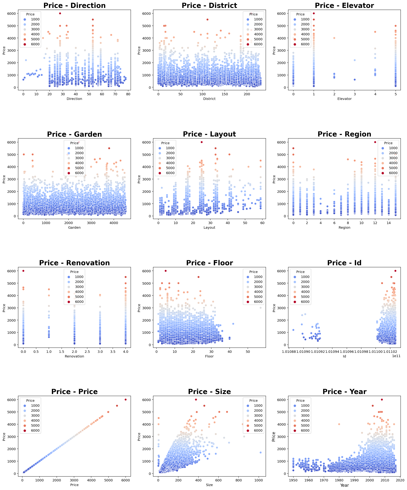
    


异常值分析


```python
import pandas as pd
import seaborn as sns
import matplotlib.pyplot as plt
from sklearn.preprocessing import LabelEncoder

df = pd.read_csv("./data/data.csv")
data_numbers = df.select_dtypes(include=['int64','float64'])
data_object = df.select_dtypes(include=['object'])
data = pd.DataFrame()
for i in range(len(data_object.columns)):
    l = LabelEncoder()
    l.fit(data_object.iloc[:,i])
    label = l.transform(data_object.iloc[:,i])
    label = pd.Series(label,name=data_object.columns[i])
    data = pd.concat([data,label],axis=1)
data =pd.concat([data,data_numbers],axis=1)
def facetgrid_boxplot(x, y, **kwargs):
    sns.boxplot(x=x, y=y)
    x=plt.xticks(rotation=90)


plt.rcParams['font.sans-serif'] = ['SimHei']
plt.rcParams['axes.unicode_minus']=False
# print(sorted(df[data.columns]))
f = pd.melt(df, id_vars=['Price'], value_vars=['Direction', 'Elevator', 'Floor', 'Layout', 'Region', 'Renovation', 'Year'])
g = sns.FacetGrid(f, col="variable", col_wrap=3, sharex=False, sharey=False, size=5,)
g = g.map(facetgrid_boxplot, "value", "Price")

plt.show()
```

    D:\anaconda\envs\ProcessData\lib\site-packages\seaborn\axisgrid.py:316: UserWarning: The `size` parameter has been renamed to `height`; please update your code.
      warnings.warn(msg, UserWarning)
    


    
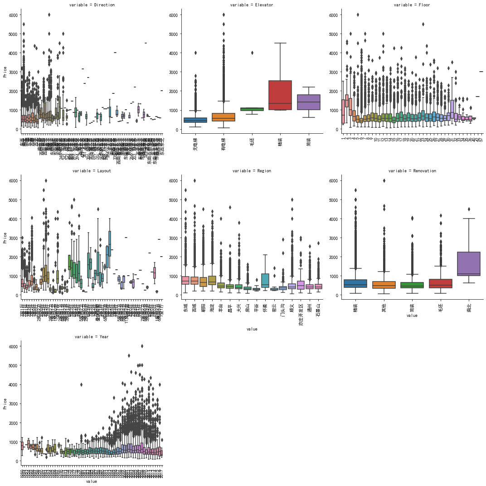
    


**让我首先引起注意的是[Layout]列，该列数据包含了两种信息，室和厅**<br>
**对于数据中的[Layout]列来说，我们需要将室和厅拆分，考虑到该列可能有不符合标准的数据，我们使用unique函数处理，看看里面都有哪些元素种类**


```python
data = pd.read_csv("./data/data.csv")
data_l = data['Layout'].unique()
print(data_l)
```

    ['3室1厅' '2室1厅' '1室1厅' '2室2厅' '3室2厅' '1室0厅' '2室0厅' '2房间2卫' '3室0厅' '5室2厅'
     '4室2厅' '3室3厅' '3房间2卫' '1房间1卫' '1房间0卫' '4室1厅' '2房间1卫' '4房间1卫' '4房间2卫'
     '3房间1卫' '6室4厅' '5室3厅' '6室2厅' '5室4厅' '4室3厅' '5房间2卫' '3房间0卫' '2房间0卫' '6室3厅'
     '7室3厅' '1室2厅' '7室2厅' '叠拼别墅' '5室1厅' '4室4厅' '6房间3卫' '8室3厅' '8室2厅' '6室5厅'
     '1室3厅' '9室2厅' '5房间3卫' '4房间3卫' '6房间4卫' '11房间3卫' '9室1厅' '4室0厅' '2室3厅'
     '8室4厅' '6室1厅' '9室3厅' '7房间2卫' '5房间0卫' '3房间3卫' '8室5厅' '5室0厅' '6室0厅' '1房间2卫'
     '6房间5卫' '7室1厅']
    

**可以看到，除了室和厅的组合，还有房价和卫生间的组合，我们所需要的是室和厅的数据。<br>对于房间和卫生间来说，房间=室，所以需要将
【室 | 厅】
【房间 | 卫生间】
拆分**

##### 【房间 卫生间】拆分


```python
data = pd.read_csv("./data/data.csv")
m = data[data['Layout'].str.contains('房间')]
m = m.loc[:,['Id','Layout']]#保留想要的列
#拆分
m.loc[:,'Layout'] = m['Layout'].str.replace('房间','|').astype('str')
m.loc[:,'Layout'] = m['Layout'].str.replace('卫','').astype('str')
x = m['Layout'].str.split('|',expand=True)#expand=True分割完不是[]格式
m = m.join(x)
m = m.drop(['Layout'],axis=1)
m = m.rename(columns={0:'Room',1:'Toilet'})
m.head(10)
```


<div>
<style scoped>
    .dataframe tbody tr th:only-of-type {
        vertical-align: middle;
    }

    .dataframe tbody tr th {
        vertical-align: top;
    }

    .dataframe thead th {
        text-align: right;
    }
</style>
<table border="1" class="dataframe">
  <thead>
    <tr style="text-align: right;">
      <th></th>
      <th>Id</th>
      <th>Room</th>
      <th>Toilet</th>
    </tr>
  </thead>
  <tbody>
    <tr>
      <th>17</th>
      <td>101102583180</td>
      <td>2</td>
      <td>2</td>
    </tr>
    <tr>
      <th>128</th>
      <td>101102486268</td>
      <td>3</td>
      <td>2</td>
    </tr>
    <tr>
      <th>129</th>
      <td>101102506007</td>
      <td>1</td>
      <td>1</td>
    </tr>
    <tr>
      <th>135</th>
      <td>101101971705</td>
      <td>1</td>
      <td>0</td>
    </tr>
    <tr>
      <th>138</th>
      <td>101101873115</td>
      <td>3</td>
      <td>2</td>
    </tr>
    <tr>
      <th>139</th>
      <td>101102351766</td>
      <td>2</td>
      <td>1</td>
    </tr>
    <tr>
      <th>143</th>
      <td>101101870128</td>
      <td>1</td>
      <td>1</td>
    </tr>
    <tr>
      <th>144</th>
      <td>101102305226</td>
      <td>4</td>
      <td>1</td>
    </tr>
    <tr>
      <th>145</th>
      <td>101101918712</td>
      <td>4</td>
      <td>2</td>
    </tr>
    <tr>
      <th>148</th>
      <td>101101870833</td>
      <td>3</td>
      <td>1</td>
    </tr>
  </tbody>
</table>
</div>


##### 【室 厅】拆分


```python
#室厅拆分
n = data[data['Layout'].str.contains('厅')]
n = n.loc[:,['Id','Layout']]
n.loc[:,'Layout'] = n['Layout'].str.replace('室','|').astype('str')
n.loc[:,'Layout'] = n['Layout'].str.replace('厅','').astype('str')
y = n['Layout'].str.split('|',expand=True)#expand=True分割完不是[]格式
n = n.join(y)
n = n.drop(['Layout'],axis=1)
n = n.rename(columns={0:'Room',1:'Hall'})
n.head(10)
```


<div>
<style scoped>
    .dataframe tbody tr th:only-of-type {
        vertical-align: middle;
    }

    .dataframe tbody tr th {
        vertical-align: top;
    }

    .dataframe thead th {
        text-align: right;
    }
</style>
<table border="1" class="dataframe">
  <thead>
    <tr style="text-align: right;">
      <th></th>
      <th>Id</th>
      <th>Room</th>
      <th>Hall</th>
    </tr>
  </thead>
  <tbody>
    <tr>
      <th>0</th>
      <td>101102647043</td>
      <td>3</td>
      <td>1</td>
    </tr>
    <tr>
      <th>1</th>
      <td>101102650978</td>
      <td>2</td>
      <td>1</td>
    </tr>
    <tr>
      <th>2</th>
      <td>101102672743</td>
      <td>3</td>
      <td>1</td>
    </tr>
    <tr>
      <th>3</th>
      <td>101102577410</td>
      <td>1</td>
      <td>1</td>
    </tr>
    <tr>
      <th>4</th>
      <td>101102574696</td>
      <td>2</td>
      <td>2</td>
    </tr>
    <tr>
      <th>5</th>
      <td>101102407993</td>
      <td>2</td>
      <td>1</td>
    </tr>
    <tr>
      <th>6</th>
      <td>101102629841</td>
      <td>1</td>
      <td>1</td>
    </tr>
    <tr>
      <th>7</th>
      <td>101102378003</td>
      <td>2</td>
      <td>1</td>
    </tr>
    <tr>
      <th>8</th>
      <td>101102345859</td>
      <td>3</td>
      <td>2</td>
    </tr>
    <tr>
      <th>9</th>
      <td>101102070529</td>
      <td>2</td>
      <td>2</td>
    </tr>
  </tbody>
</table>
</div>


>保留Id是为了之后的数据整合，因为Id是唯一的，可以通过Id寻找到该数据的来源

**做完这些步骤，我们将原先数据中的一些中文表达的意思用数字表示，方便后续的处理**


```python
#替换电梯的参数
data = data.replace('有电梯',1)
data = data.replace('无电梯',0)
#替换装修的参数
data = data.replace('精装',3)
data = data.replace('简装',2)
data = data.replace('毛坯',1)
data = data.replace('其他',0)
data.head(10)
```


<div>
<style scoped>
    .dataframe tbody tr th:only-of-type {
        vertical-align: middle;
    }

    .dataframe tbody tr th {
        vertical-align: top;
    }

    .dataframe thead th {
        text-align: right;
    }
</style>
<table border="1" class="dataframe">
  <thead>
    <tr style="text-align: right;">
      <th></th>
      <th>Direction</th>
      <th>District</th>
      <th>Elevator</th>
      <th>Floor</th>
      <th>Garden</th>
      <th>Id</th>
      <th>Layout</th>
      <th>Price</th>
      <th>Region</th>
      <th>Renovation</th>
      <th>Size</th>
      <th>Year</th>
    </tr>
  </thead>
  <tbody>
    <tr>
      <th>0</th>
      <td>东西</td>
      <td>灯市口</td>
      <td>NaN</td>
      <td>6</td>
      <td>锡拉胡同21号院</td>
      <td>101102647043</td>
      <td>3室1厅</td>
      <td>780.0</td>
      <td>东城</td>
      <td>3</td>
      <td>75.0</td>
      <td>1988</td>
    </tr>
    <tr>
      <th>1</th>
      <td>南北</td>
      <td>东单</td>
      <td>0.0</td>
      <td>6</td>
      <td>东华门大街</td>
      <td>101102650978</td>
      <td>2室1厅</td>
      <td>705.0</td>
      <td>东城</td>
      <td>3</td>
      <td>60.0</td>
      <td>1988</td>
    </tr>
    <tr>
      <th>2</th>
      <td>南西</td>
      <td>崇文门</td>
      <td>1.0</td>
      <td>16</td>
      <td>新世界中心</td>
      <td>101102672743</td>
      <td>3室1厅</td>
      <td>1400.0</td>
      <td>东城</td>
      <td>0</td>
      <td>210.0</td>
      <td>1996</td>
    </tr>
    <tr>
      <th>3</th>
      <td>南</td>
      <td>崇文门</td>
      <td>NaN</td>
      <td>7</td>
      <td>兴隆都市馨园</td>
      <td>101102577410</td>
      <td>1室1厅</td>
      <td>420.0</td>
      <td>东城</td>
      <td>3</td>
      <td>39.0</td>
      <td>2004</td>
    </tr>
    <tr>
      <th>4</th>
      <td>南</td>
      <td>陶然亭</td>
      <td>1.0</td>
      <td>19</td>
      <td>中海紫御公馆</td>
      <td>101102574696</td>
      <td>2室2厅</td>
      <td>998.0</td>
      <td>东城</td>
      <td>3</td>
      <td>90.0</td>
      <td>2010</td>
    </tr>
    <tr>
      <th>5</th>
      <td>南北</td>
      <td>广渠门</td>
      <td>1.0</td>
      <td>18</td>
      <td>幸福家园二期</td>
      <td>101102407993</td>
      <td>2室1厅</td>
      <td>1180.0</td>
      <td>东城</td>
      <td>0</td>
      <td>111.0</td>
      <td>2003</td>
    </tr>
    <tr>
      <th>6</th>
      <td>南</td>
      <td>西罗园</td>
      <td>0.0</td>
      <td>6</td>
      <td>西革新里110号院</td>
      <td>101102629841</td>
      <td>1室1厅</td>
      <td>319.0</td>
      <td>东城</td>
      <td>0</td>
      <td>42.0</td>
      <td>1992</td>
    </tr>
    <tr>
      <th>7</th>
      <td>南</td>
      <td>西罗园</td>
      <td>1.0</td>
      <td>16</td>
      <td>建予园</td>
      <td>101102378003</td>
      <td>2室1厅</td>
      <td>640.0</td>
      <td>东城</td>
      <td>0</td>
      <td>105.0</td>
      <td>1999</td>
    </tr>
    <tr>
      <th>8</th>
      <td>南北</td>
      <td>东花市</td>
      <td>1.0</td>
      <td>9</td>
      <td>富贵园一区</td>
      <td>101102345859</td>
      <td>3室2厅</td>
      <td>1780.0</td>
      <td>东城</td>
      <td>3</td>
      <td>161.0</td>
      <td>2003</td>
    </tr>
    <tr>
      <th>9</th>
      <td>东北</td>
      <td>东直门</td>
      <td>1.0</td>
      <td>25</td>
      <td>万国城MOMA</td>
      <td>101102070529</td>
      <td>2室2厅</td>
      <td>1300.0</td>
      <td>东城</td>
      <td>3</td>
      <td>127.0</td>
      <td>2002</td>
    </tr>
  </tbody>
</table>
</div>


**使用onehot编码对方向进行编排**


```python
data_Direction = pd.get_dummies(data['Direction'])
data_Direction.head(15)
```


<div>
<style scoped>
    .dataframe tbody tr th:only-of-type {
        vertical-align: middle;
    }

    .dataframe tbody tr th {
        vertical-align: top;
    }

    .dataframe thead th {
        text-align: right;
    }
</style>
<table border="1" class="dataframe">
  <thead>
    <tr style="text-align: right;">
      <th></th>
      <th>107.93平米</th>
      <th>195.32平米</th>
      <th>203.73平米</th>
      <th>240.97平米</th>
      <th>242.78平米</th>
      <th>242.96平米</th>
      <th>259.76平米</th>
      <th>259.87平米</th>
      <th>260.07平米</th>
      <th>264.6平米</th>
      <th>...</th>
      <th>西北北</th>
      <th>西南</th>
      <th>西南东北</th>
      <th>西南北</th>
      <th>西南西</th>
      <th>西南西北</th>
      <th>西南西北东北</th>
      <th>西南西北北</th>
      <th>西西北</th>
      <th>西西南</th>
    </tr>
  </thead>
  <tbody>
    <tr>
      <th>0</th>
      <td>0</td>
      <td>0</td>
      <td>0</td>
      <td>0</td>
      <td>0</td>
      <td>0</td>
      <td>0</td>
      <td>0</td>
      <td>0</td>
      <td>0</td>
      <td>...</td>
      <td>0</td>
      <td>0</td>
      <td>0</td>
      <td>0</td>
      <td>0</td>
      <td>0</td>
      <td>0</td>
      <td>0</td>
      <td>0</td>
      <td>0</td>
    </tr>
    <tr>
      <th>1</th>
      <td>0</td>
      <td>0</td>
      <td>0</td>
      <td>0</td>
      <td>0</td>
      <td>0</td>
      <td>0</td>
      <td>0</td>
      <td>0</td>
      <td>0</td>
      <td>...</td>
      <td>0</td>
      <td>0</td>
      <td>0</td>
      <td>0</td>
      <td>0</td>
      <td>0</td>
      <td>0</td>
      <td>0</td>
      <td>0</td>
      <td>0</td>
    </tr>
    <tr>
      <th>2</th>
      <td>0</td>
      <td>0</td>
      <td>0</td>
      <td>0</td>
      <td>0</td>
      <td>0</td>
      <td>0</td>
      <td>0</td>
      <td>0</td>
      <td>0</td>
      <td>...</td>
      <td>0</td>
      <td>0</td>
      <td>0</td>
      <td>0</td>
      <td>0</td>
      <td>0</td>
      <td>0</td>
      <td>0</td>
      <td>0</td>
      <td>0</td>
    </tr>
    <tr>
      <th>3</th>
      <td>0</td>
      <td>0</td>
      <td>0</td>
      <td>0</td>
      <td>0</td>
      <td>0</td>
      <td>0</td>
      <td>0</td>
      <td>0</td>
      <td>0</td>
      <td>...</td>
      <td>0</td>
      <td>0</td>
      <td>0</td>
      <td>0</td>
      <td>0</td>
      <td>0</td>
      <td>0</td>
      <td>0</td>
      <td>0</td>
      <td>0</td>
    </tr>
    <tr>
      <th>4</th>
      <td>0</td>
      <td>0</td>
      <td>0</td>
      <td>0</td>
      <td>0</td>
      <td>0</td>
      <td>0</td>
      <td>0</td>
      <td>0</td>
      <td>0</td>
      <td>...</td>
      <td>0</td>
      <td>0</td>
      <td>0</td>
      <td>0</td>
      <td>0</td>
      <td>0</td>
      <td>0</td>
      <td>0</td>
      <td>0</td>
      <td>0</td>
    </tr>
    <tr>
      <th>5</th>
      <td>0</td>
      <td>0</td>
      <td>0</td>
      <td>0</td>
      <td>0</td>
      <td>0</td>
      <td>0</td>
      <td>0</td>
      <td>0</td>
      <td>0</td>
      <td>...</td>
      <td>0</td>
      <td>0</td>
      <td>0</td>
      <td>0</td>
      <td>0</td>
      <td>0</td>
      <td>0</td>
      <td>0</td>
      <td>0</td>
      <td>0</td>
    </tr>
    <tr>
      <th>6</th>
      <td>0</td>
      <td>0</td>
      <td>0</td>
      <td>0</td>
      <td>0</td>
      <td>0</td>
      <td>0</td>
      <td>0</td>
      <td>0</td>
      <td>0</td>
      <td>...</td>
      <td>0</td>
      <td>0</td>
      <td>0</td>
      <td>0</td>
      <td>0</td>
      <td>0</td>
      <td>0</td>
      <td>0</td>
      <td>0</td>
      <td>0</td>
    </tr>
    <tr>
      <th>7</th>
      <td>0</td>
      <td>0</td>
      <td>0</td>
      <td>0</td>
      <td>0</td>
      <td>0</td>
      <td>0</td>
      <td>0</td>
      <td>0</td>
      <td>0</td>
      <td>...</td>
      <td>0</td>
      <td>0</td>
      <td>0</td>
      <td>0</td>
      <td>0</td>
      <td>0</td>
      <td>0</td>
      <td>0</td>
      <td>0</td>
      <td>0</td>
    </tr>
    <tr>
      <th>8</th>
      <td>0</td>
      <td>0</td>
      <td>0</td>
      <td>0</td>
      <td>0</td>
      <td>0</td>
      <td>0</td>
      <td>0</td>
      <td>0</td>
      <td>0</td>
      <td>...</td>
      <td>0</td>
      <td>0</td>
      <td>0</td>
      <td>0</td>
      <td>0</td>
      <td>0</td>
      <td>0</td>
      <td>0</td>
      <td>0</td>
      <td>0</td>
    </tr>
    <tr>
      <th>9</th>
      <td>0</td>
      <td>0</td>
      <td>0</td>
      <td>0</td>
      <td>0</td>
      <td>0</td>
      <td>0</td>
      <td>0</td>
      <td>0</td>
      <td>0</td>
      <td>...</td>
      <td>0</td>
      <td>0</td>
      <td>0</td>
      <td>0</td>
      <td>0</td>
      <td>0</td>
      <td>0</td>
      <td>0</td>
      <td>0</td>
      <td>0</td>
    </tr>
    <tr>
      <th>10</th>
      <td>0</td>
      <td>0</td>
      <td>0</td>
      <td>0</td>
      <td>0</td>
      <td>0</td>
      <td>0</td>
      <td>0</td>
      <td>0</td>
      <td>0</td>
      <td>...</td>
      <td>0</td>
      <td>0</td>
      <td>0</td>
      <td>0</td>
      <td>0</td>
      <td>0</td>
      <td>0</td>
      <td>0</td>
      <td>0</td>
      <td>0</td>
    </tr>
    <tr>
      <th>11</th>
      <td>0</td>
      <td>0</td>
      <td>0</td>
      <td>0</td>
      <td>0</td>
      <td>0</td>
      <td>0</td>
      <td>0</td>
      <td>0</td>
      <td>0</td>
      <td>...</td>
      <td>0</td>
      <td>0</td>
      <td>0</td>
      <td>0</td>
      <td>0</td>
      <td>0</td>
      <td>0</td>
      <td>0</td>
      <td>0</td>
      <td>0</td>
    </tr>
    <tr>
      <th>12</th>
      <td>0</td>
      <td>0</td>
      <td>0</td>
      <td>0</td>
      <td>0</td>
      <td>0</td>
      <td>0</td>
      <td>0</td>
      <td>0</td>
      <td>0</td>
      <td>...</td>
      <td>0</td>
      <td>0</td>
      <td>0</td>
      <td>0</td>
      <td>0</td>
      <td>0</td>
      <td>0</td>
      <td>0</td>
      <td>0</td>
      <td>0</td>
    </tr>
    <tr>
      <th>13</th>
      <td>0</td>
      <td>0</td>
      <td>0</td>
      <td>0</td>
      <td>0</td>
      <td>0</td>
      <td>0</td>
      <td>0</td>
      <td>0</td>
      <td>0</td>
      <td>...</td>
      <td>0</td>
      <td>0</td>
      <td>0</td>
      <td>0</td>
      <td>0</td>
      <td>0</td>
      <td>0</td>
      <td>0</td>
      <td>0</td>
      <td>0</td>
    </tr>
    <tr>
      <th>14</th>
      <td>0</td>
      <td>0</td>
      <td>0</td>
      <td>0</td>
      <td>0</td>
      <td>0</td>
      <td>0</td>
      <td>0</td>
      <td>0</td>
      <td>0</td>
      <td>...</td>
      <td>0</td>
      <td>1</td>
      <td>0</td>
      <td>0</td>
      <td>0</td>
      <td>0</td>
      <td>0</td>
      <td>0</td>
      <td>0</td>
      <td>0</td>
    </tr>
  </tbody>
</table>
<p>15 rows × 79 columns</p>
</div>


**使用onehot对装修方式进行onehot编码**


```python
data = data[data['Renovation']!='南北']
data_renovation = pd.get_dummies(data['Renovation'])
data_renovation = data_renovation.rename(columns={3:'精装',2:'简装',1:'毛坯',0:'其他'})
data_renovation.head(8)
```


<div>
<style scoped>
    .dataframe tbody tr th:only-of-type {
        vertical-align: middle;
    }

    .dataframe tbody tr th {
        vertical-align: top;
    }

    .dataframe thead th {
        text-align: right;
    }
</style>
<table border="1" class="dataframe">
  <thead>
    <tr style="text-align: right;">
      <th></th>
      <th>其他</th>
      <th>毛坯</th>
      <th>简装</th>
      <th>精装</th>
    </tr>
  </thead>
  <tbody>
    <tr>
      <th>0</th>
      <td>0</td>
      <td>0</td>
      <td>0</td>
      <td>1</td>
    </tr>
    <tr>
      <th>1</th>
      <td>0</td>
      <td>0</td>
      <td>0</td>
      <td>1</td>
    </tr>
    <tr>
      <th>2</th>
      <td>1</td>
      <td>0</td>
      <td>0</td>
      <td>0</td>
    </tr>
    <tr>
      <th>3</th>
      <td>0</td>
      <td>0</td>
      <td>0</td>
      <td>1</td>
    </tr>
    <tr>
      <th>4</th>
      <td>0</td>
      <td>0</td>
      <td>0</td>
      <td>1</td>
    </tr>
    <tr>
      <th>5</th>
      <td>1</td>
      <td>0</td>
      <td>0</td>
      <td>0</td>
    </tr>
    <tr>
      <th>6</th>
      <td>1</td>
      <td>0</td>
      <td>0</td>
      <td>0</td>
    </tr>
    <tr>
      <th>7</th>
      <td>1</td>
      <td>0</td>
      <td>0</td>
      <td>0</td>
    </tr>
  </tbody>
</table>
</div>


__为什么使用onehot编码_

>One-Hot编码，又称为一位有效编码，主要是采用N位状态寄存器来对N个状态进行编码，每个状态都由他独立的寄存器位，并且在任意时候只有一位有效。<br>
>One-Hot编码是分类变量作为二进制向量的表示。这首先要求将分类值映射到整数值。然后，每个整数值被表示为二进制向量，除了整数的索引之外，它都是零值，它被标记为1。

>onehot用来编码线性无关的属性，在后续knn计算时会减少精度的丢失

### 将编码和拆分后的数据整合


```python
data_clean = pd.read_csv('./data/data_clean.csv')
data_clean.head(10)
```


<div>
<style scoped>
    .dataframe tbody tr th:only-of-type {
        vertical-align: middle;
    }

    .dataframe tbody tr th {
        vertical-align: top;
    }

    .dataframe thead th {
        text-align: right;
    }
</style>
<table border="1" class="dataframe">
  <thead>
    <tr style="text-align: right;">
      <th></th>
      <th>Direction</th>
      <th>District</th>
      <th>Elevator</th>
      <th>Floor</th>
      <th>Garden</th>
      <th>Id</th>
      <th>Layout</th>
      <th>Price</th>
      <th>Region</th>
      <th>Renovation</th>
      <th>...</th>
      <th>西城</th>
      <th>通州</th>
      <th>门头沟</th>
      <th>顺义</th>
      <th>其他</th>
      <th>毛坯</th>
      <th>简装</th>
      <th>精装</th>
      <th>Room</th>
      <th>Hall</th>
    </tr>
  </thead>
  <tbody>
    <tr>
      <th>0</th>
      <td>东西</td>
      <td>灯市口</td>
      <td>NaN</td>
      <td>6</td>
      <td>锡拉胡同21号院</td>
      <td>101102647043</td>
      <td>3室1厅</td>
      <td>780.0</td>
      <td>东城</td>
      <td>3</td>
      <td>...</td>
      <td>0</td>
      <td>0</td>
      <td>0</td>
      <td>0</td>
      <td>0</td>
      <td>0</td>
      <td>0</td>
      <td>1</td>
      <td>3</td>
      <td>1.0</td>
    </tr>
    <tr>
      <th>1</th>
      <td>南北</td>
      <td>东单</td>
      <td>0.0</td>
      <td>6</td>
      <td>东华门大街</td>
      <td>101102650978</td>
      <td>2室1厅</td>
      <td>705.0</td>
      <td>东城</td>
      <td>3</td>
      <td>...</td>
      <td>0</td>
      <td>0</td>
      <td>0</td>
      <td>0</td>
      <td>0</td>
      <td>0</td>
      <td>0</td>
      <td>1</td>
      <td>2</td>
      <td>1.0</td>
    </tr>
    <tr>
      <th>2</th>
      <td>南西</td>
      <td>崇文门</td>
      <td>1.0</td>
      <td>16</td>
      <td>新世界中心</td>
      <td>101102672743</td>
      <td>3室1厅</td>
      <td>1400.0</td>
      <td>东城</td>
      <td>0</td>
      <td>...</td>
      <td>0</td>
      <td>0</td>
      <td>0</td>
      <td>0</td>
      <td>1</td>
      <td>0</td>
      <td>0</td>
      <td>0</td>
      <td>3</td>
      <td>1.0</td>
    </tr>
    <tr>
      <th>3</th>
      <td>南</td>
      <td>崇文门</td>
      <td>NaN</td>
      <td>7</td>
      <td>兴隆都市馨园</td>
      <td>101102577410</td>
      <td>1室1厅</td>
      <td>420.0</td>
      <td>东城</td>
      <td>3</td>
      <td>...</td>
      <td>0</td>
      <td>0</td>
      <td>0</td>
      <td>0</td>
      <td>0</td>
      <td>0</td>
      <td>0</td>
      <td>1</td>
      <td>1</td>
      <td>1.0</td>
    </tr>
    <tr>
      <th>4</th>
      <td>南</td>
      <td>崇文门</td>
      <td>NaN</td>
      <td>7</td>
      <td>兴隆都市馨园</td>
      <td>101102577410</td>
      <td>1室1厅</td>
      <td>420.0</td>
      <td>东城</td>
      <td>3</td>
      <td>...</td>
      <td>0</td>
      <td>0</td>
      <td>0</td>
      <td>0</td>
      <td>0</td>
      <td>0</td>
      <td>0</td>
      <td>1</td>
      <td>1</td>
      <td>1.0</td>
    </tr>
    <tr>
      <th>5</th>
      <td>南</td>
      <td>陶然亭</td>
      <td>1.0</td>
      <td>19</td>
      <td>中海紫御公馆</td>
      <td>101102574696</td>
      <td>2室2厅</td>
      <td>998.0</td>
      <td>东城</td>
      <td>3</td>
      <td>...</td>
      <td>0</td>
      <td>0</td>
      <td>0</td>
      <td>0</td>
      <td>0</td>
      <td>0</td>
      <td>0</td>
      <td>1</td>
      <td>2</td>
      <td>2.0</td>
    </tr>
    <tr>
      <th>6</th>
      <td>南北</td>
      <td>广渠门</td>
      <td>1.0</td>
      <td>18</td>
      <td>幸福家园二期</td>
      <td>101102407993</td>
      <td>2室1厅</td>
      <td>1180.0</td>
      <td>东城</td>
      <td>0</td>
      <td>...</td>
      <td>0</td>
      <td>0</td>
      <td>0</td>
      <td>0</td>
      <td>1</td>
      <td>0</td>
      <td>0</td>
      <td>0</td>
      <td>2</td>
      <td>1.0</td>
    </tr>
    <tr>
      <th>7</th>
      <td>南</td>
      <td>西罗园</td>
      <td>0.0</td>
      <td>6</td>
      <td>西革新里110号院</td>
      <td>101102629841</td>
      <td>1室1厅</td>
      <td>319.0</td>
      <td>东城</td>
      <td>0</td>
      <td>...</td>
      <td>0</td>
      <td>0</td>
      <td>0</td>
      <td>0</td>
      <td>1</td>
      <td>0</td>
      <td>0</td>
      <td>0</td>
      <td>1</td>
      <td>1.0</td>
    </tr>
    <tr>
      <th>8</th>
      <td>南</td>
      <td>西罗园</td>
      <td>1.0</td>
      <td>16</td>
      <td>建予园</td>
      <td>101102378003</td>
      <td>2室1厅</td>
      <td>640.0</td>
      <td>东城</td>
      <td>0</td>
      <td>...</td>
      <td>0</td>
      <td>0</td>
      <td>0</td>
      <td>0</td>
      <td>1</td>
      <td>0</td>
      <td>0</td>
      <td>0</td>
      <td>2</td>
      <td>1.0</td>
    </tr>
    <tr>
      <th>9</th>
      <td>南北</td>
      <td>东花市</td>
      <td>1.0</td>
      <td>9</td>
      <td>富贵园一区</td>
      <td>101102345859</td>
      <td>3室2厅</td>
      <td>1780.0</td>
      <td>东城</td>
      <td>3</td>
      <td>...</td>
      <td>0</td>
      <td>0</td>
      <td>0</td>
      <td>0</td>
      <td>0</td>
      <td>0</td>
      <td>0</td>
      <td>1</td>
      <td>3</td>
      <td>2.0</td>
    </tr>
  </tbody>
</table>
<p>10 rows × 93 columns</p>
</div>


---

# 数据检测

检查数据是否有缺失值，如果有，考虑如何填充


```python
data_null = (data_clean.isnull().sum()/len(data_clean))*100
data_null = data_null.drop(data_null[data_null == 0].index).sort_values(ascending=False)[:30]
missing_data = pd.DataFrame({'Missing Data':data_null})
m = missing_data.head(5)
print(m)
sns.set(font='simhei')
plt.rcParams['axes.unicode_minus'] = False
plt.figure(figsize=(6,8))
plt.xticks(rotation = 90,fontsize=20)
plt.yticks(fontsize=20)
sns.barplot(x=data_null.index,y=data_null)
plt.xlabel('缺失值列名',fontsize=25)
plt.ylabel('占总数据的百分比(%)',fontsize=25)
plt.title('缺失值占比柱状图',fontsize=42)
plt.show()
```

              Missing Data
    Elevator     34.140083
    Hall          2.355149
    


    
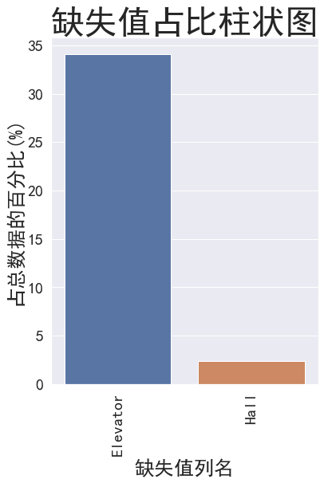
    


>可以看到，【电梯】【厅】列有缺失值，并且电梯的缺失值占比很高

---

# 数据探索

**1、**房价与哪些因素有关<br>
**2、**属性之间有什么关系<br>
**3、**房价的变动是否存在规律

### 价格与年份的箱型图：


```python
%%time
data_train = pd.concat([data_clean['Price'],data_clean['Year']],axis=1)
plt.figure(figsize=(12,9))
sns.boxplot(x='Year',y='Price',data=data_train)
plt.axis(ymin=0,ymax=7000)
plt.xticks(rotation=90)
plt.show()
```


    
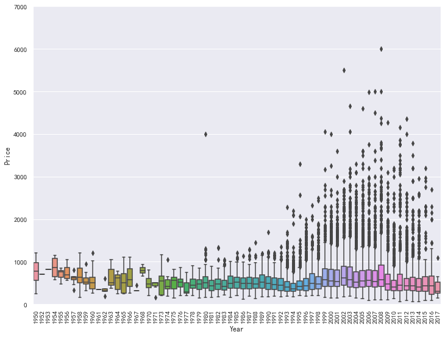
    


    Wall time: 2.62 s
    

>可以看到，随着年份的增长，平均房价有所波动，但总体趋于平稳，但是房价的上限在不断的增加

### 让我们再来看看价格与各个数据的散点图：


```python
# for i in range(10):
#     sns.set(font='simhei')
#     plt.rcParams['axes.unicode_minus'] = False
#     sns.pairplot(data_clean, x_vars=data_clean.columns.values[10*i:10*(i+1)], y_vars="Price")
#     plt.show()
df = data_clean
data_numbers = df.select_dtypes(include=['int64','float64'])
data_object = df.select_dtypes(include=['object'])
data = pd.DataFrame()
for i in range(len(data_object.columns)):
    l = LabelEncoder()
    l.fit(data_object.iloc[:,i])
    label = l.transform(data_object.iloc[:,i])
    label = pd.Series(label,name=data_object.columns[i])
    data = pd.concat([data,label],axis=1)
data =pd.concat([data,data_numbers],axis=1)


plt.rcParams['font.sans-serif'] = ['SimHei']
plt.rcParams['axes.unicode_minus']=False
fig,axs= plt.subplots(10,10,figsize=(40,60),dpi=144)
fig.subplots_adjust(hspace=0.6)

for i,ax in zip(data.columns,axs.flatten()):
    sns.scatterplot(x=i, y='Price', hue='Price',data=data,ax=ax,palette='coolwarm')
    plt.xlabel(i,fontsize=12)
    plt.ylabel('Price',fontsize=12)
    ax.set_title('Price'+' - '+str(i),fontweight='bold',size=20)

plt.show()
```


    
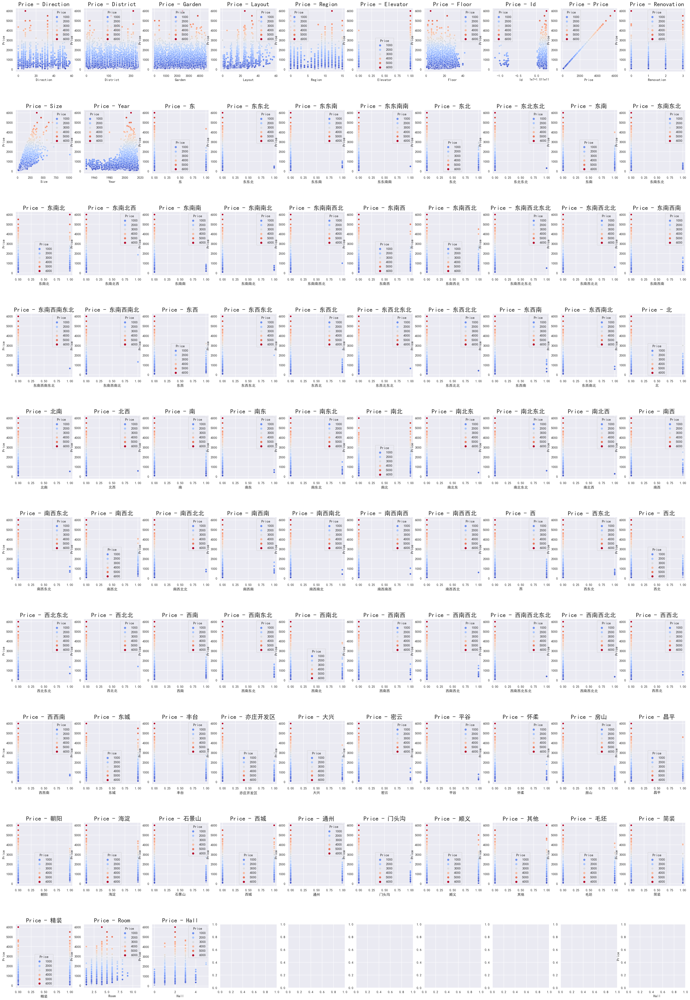
    


### 绘制热力图


```python
plt.figure(figsize=(36,27))
corr = data_clean.corr()
sns.heatmap(corr[(corr>=0.2)|(corr<=-0.2)],cmap='Greys',annot=True,linewidths=1,linecolor='b')
plt.title('相关性系数矩阵热力图',fontsize=30)
plt.show()
```


    
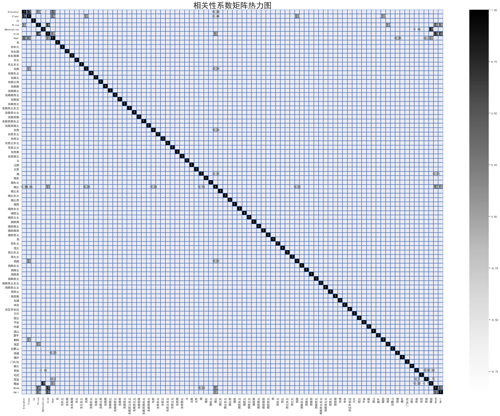
    


>绘制时将相关性低于0.2的都不显示，可以看到该图非常的难以阅读，接下来得考虑从新作图

---

### 数据检测和数据探索总结：<br>
**1**.房价和年份、大小可能有关系；<br>**2**.【电梯】【厅】列有缺失值，需要补全；<br>**3**.散点图可以大概了解情况，但还是需要热力图来更直接的观察;<br>**4**.使用onehot编码后的数据绘制热力图不能很直观的反应出各列的相关性系数，需要化简后重新绘制

---

# 数据预处理

### 1、将数据中的NAN空值填充

> 调用sklearn包，里面有很多机器学习的算法包，这里我们选择knn算法来填充空值

    定义knn函数


```python
def knn_missing_filled(x_train,y_train,test,k=5,dispersed=True):
    """
    定义knn填充空值函数
    x_train,y_train为训练集，test为需要填充的数据
    dispersed=True时，填充值为整数
    dispersed=False时，填充值为精确值
    """
    if dispersed:
        clf = KNeighborsClassifier(n_neighbors=k,weights="distance")
        """
            交叉验证
            :param为最优化的参数取值
            cv 指定flod数量
        """
        param={
            "n_neighbors":[1,3,5],
        }
        cv = GridSearchCV(clf,param_grid=param,cv=2)
        cv.fit(x_train,y_train)
        print(cv.best_score_)
    else:
        clf = KNeighborsRegressor(n_neighbors=k,weights="distance")
    clf.fit(x_train,y_train)
    return test.index,clf.predict(test)
```

>因为knn算法是根据步长来填充空值，所以在导入数据之前需要进行归一化处理<br>这里我们选择Z-score进行处理<br>$$x′=\frac{x - \mu}{\sigma}$$


```python
data_clean['Year'] = (data_clean['Year']-data_clean['Year'].mean())/data_clean['Year'].std()
data_clean['Floor'] = (data_clean['Floor']-data_clean['Floor'].mean())/data_clean['Floor'].std()
data_clean['Size'] = (data_clean['Size']-data_clean['Size'].mean())/data_clean['Size'].std()
data_clean['Price'] = (data_clean['Price']-data_clean['Price'].mean())/data_clean['Price'].std()
data_clean.head(10)
```


<div>
<style scoped>
    .dataframe tbody tr th:only-of-type {
        vertical-align: middle;
    }

    .dataframe tbody tr th {
        vertical-align: top;
    }

    .dataframe thead th {
        text-align: right;
    }
</style>
<table border="1" class="dataframe">
  <thead>
    <tr style="text-align: right;">
      <th></th>
      <th>Direction</th>
      <th>District</th>
      <th>Elevator</th>
      <th>Floor</th>
      <th>Garden</th>
      <th>Id</th>
      <th>Layout</th>
      <th>Price</th>
      <th>Region</th>
      <th>Renovation</th>
      <th>...</th>
      <th>西城</th>
      <th>通州</th>
      <th>门头沟</th>
      <th>顺义</th>
      <th>其他</th>
      <th>毛坯</th>
      <th>简装</th>
      <th>精装</th>
      <th>Room</th>
      <th>Hall</th>
    </tr>
  </thead>
  <tbody>
    <tr>
      <th>0</th>
      <td>东西</td>
      <td>灯市口</td>
      <td>NaN</td>
      <td>-0.892738</td>
      <td>锡拉胡同21号院</td>
      <td>101102647043</td>
      <td>3室1厅</td>
      <td>0.407308</td>
      <td>东城</td>
      <td>3</td>
      <td>...</td>
      <td>0</td>
      <td>0</td>
      <td>0</td>
      <td>0</td>
      <td>0</td>
      <td>0</td>
      <td>0</td>
      <td>1</td>
      <td>3</td>
      <td>1.0</td>
    </tr>
    <tr>
      <th>1</th>
      <td>南北</td>
      <td>东单</td>
      <td>0.0</td>
      <td>-0.892738</td>
      <td>东华门大街</td>
      <td>101102650978</td>
      <td>2室1厅</td>
      <td>0.223340</td>
      <td>东城</td>
      <td>3</td>
      <td>...</td>
      <td>0</td>
      <td>0</td>
      <td>0</td>
      <td>0</td>
      <td>0</td>
      <td>0</td>
      <td>0</td>
      <td>1</td>
      <td>2</td>
      <td>1.0</td>
    </tr>
    <tr>
      <th>2</th>
      <td>南西</td>
      <td>崇文门</td>
      <td>1.0</td>
      <td>0.409947</td>
      <td>新世界中心</td>
      <td>101102672743</td>
      <td>3室1厅</td>
      <td>1.928113</td>
      <td>东城</td>
      <td>0</td>
      <td>...</td>
      <td>0</td>
      <td>0</td>
      <td>0</td>
      <td>0</td>
      <td>1</td>
      <td>0</td>
      <td>0</td>
      <td>0</td>
      <td>3</td>
      <td>1.0</td>
    </tr>
    <tr>
      <th>3</th>
      <td>南</td>
      <td>崇文门</td>
      <td>NaN</td>
      <td>-0.762469</td>
      <td>兴隆都市馨园</td>
      <td>101102577410</td>
      <td>1室1厅</td>
      <td>-0.475739</td>
      <td>东城</td>
      <td>3</td>
      <td>...</td>
      <td>0</td>
      <td>0</td>
      <td>0</td>
      <td>0</td>
      <td>0</td>
      <td>0</td>
      <td>0</td>
      <td>1</td>
      <td>1</td>
      <td>1.0</td>
    </tr>
    <tr>
      <th>4</th>
      <td>南</td>
      <td>崇文门</td>
      <td>NaN</td>
      <td>-0.762469</td>
      <td>兴隆都市馨园</td>
      <td>101102577410</td>
      <td>1室1厅</td>
      <td>-0.475739</td>
      <td>东城</td>
      <td>3</td>
      <td>...</td>
      <td>0</td>
      <td>0</td>
      <td>0</td>
      <td>0</td>
      <td>0</td>
      <td>0</td>
      <td>0</td>
      <td>1</td>
      <td>1</td>
      <td>1.0</td>
    </tr>
    <tr>
      <th>5</th>
      <td>南</td>
      <td>陶然亭</td>
      <td>1.0</td>
      <td>0.800752</td>
      <td>中海紫御公馆</td>
      <td>101102574696</td>
      <td>2室2厅</td>
      <td>0.942043</td>
      <td>东城</td>
      <td>3</td>
      <td>...</td>
      <td>0</td>
      <td>0</td>
      <td>0</td>
      <td>0</td>
      <td>0</td>
      <td>0</td>
      <td>0</td>
      <td>1</td>
      <td>2</td>
      <td>2.0</td>
    </tr>
    <tr>
      <th>6</th>
      <td>南北</td>
      <td>广渠门</td>
      <td>1.0</td>
      <td>0.670484</td>
      <td>幸福家园二期</td>
      <td>101102407993</td>
      <td>2室1厅</td>
      <td>1.388473</td>
      <td>东城</td>
      <td>0</td>
      <td>...</td>
      <td>0</td>
      <td>0</td>
      <td>0</td>
      <td>0</td>
      <td>1</td>
      <td>0</td>
      <td>0</td>
      <td>0</td>
      <td>2</td>
      <td>1.0</td>
    </tr>
    <tr>
      <th>7</th>
      <td>南</td>
      <td>西罗园</td>
      <td>0.0</td>
      <td>-0.892738</td>
      <td>西革新里110号院</td>
      <td>101102629841</td>
      <td>1室1厅</td>
      <td>-0.723483</td>
      <td>东城</td>
      <td>0</td>
      <td>...</td>
      <td>0</td>
      <td>0</td>
      <td>0</td>
      <td>0</td>
      <td>1</td>
      <td>0</td>
      <td>0</td>
      <td>0</td>
      <td>1</td>
      <td>1.0</td>
    </tr>
    <tr>
      <th>8</th>
      <td>南</td>
      <td>西罗园</td>
      <td>1.0</td>
      <td>0.409947</td>
      <td>建予园</td>
      <td>101102378003</td>
      <td>2室1厅</td>
      <td>0.063901</td>
      <td>东城</td>
      <td>0</td>
      <td>...</td>
      <td>0</td>
      <td>0</td>
      <td>0</td>
      <td>0</td>
      <td>1</td>
      <td>0</td>
      <td>0</td>
      <td>0</td>
      <td>2</td>
      <td>1.0</td>
    </tr>
    <tr>
      <th>9</th>
      <td>南北</td>
      <td>东花市</td>
      <td>1.0</td>
      <td>-0.501932</td>
      <td>富贵园一区</td>
      <td>101102345859</td>
      <td>3室2厅</td>
      <td>2.860219</td>
      <td>东城</td>
      <td>3</td>
      <td>...</td>
      <td>0</td>
      <td>0</td>
      <td>0</td>
      <td>0</td>
      <td>0</td>
      <td>0</td>
      <td>0</td>
      <td>1</td>
      <td>3</td>
      <td>2.0</td>
    </tr>
  </tbody>
</table>
<p>10 rows × 93 columns</p>
</div>


### 为什么要归一化？
>减少噪声数据对knn的影响，因为knn算法的本质是步长计算，噪声数据对计算的影响会很大<br>并且归一化后获得的值准确率会更高

   ##### 准备工作做完就可以使用knn算法填充空值了


```python
data = pd.read_csv('./data/data_clean_normalization.csv')
data = data.loc[:,['Elevator','Floor','Price','Size','Year','Room','Hall','Id']]
#[电梯]列nan填充
Elevator_x_train = data[data['Elevator'].notnull()].loc[:,['Floor','Year']]
Elevator_y_train = data[data['Elevator'].notnull()]['Elevator']
Elevator_test = data[data['Elevator'].isnull()].loc[:,['Floor','Year']]
Elevator_index,Elevator_value = knn_missing_filled(Elevator_x_train,Elevator_y_train,Elevator_test,k=5,dispersed=True)
data.loc[Elevator_index,'Elevator'] = Elevator_value

#[厅]列nan填充
Hall_x_train = data[data['Hall'].notnull()].loc[:,['Floor','Price','Size','Year','Room']]
Hall_y_train = data[data['Hall'].notnull()]['Hall']
Hall_test = data[data['Hall'].isnull()].loc[:,['Floor','Price','Size','Year','Room']]
Hall_index,Hall_value = knn_missing_filled(Hall_x_train,Hall_y_train,Hall_test,k=5,dispersed=True)
data.loc[Hall_index,'Hall'] = Hall_value

#处理归一化数据，变回原来的样子
data_clean = pd.read_csv('./data/data_clean.csv')
data['Year'] = data['Year']*data_clean['Year'].std()+data_clean['Year'].mean()
data['Floor'] = data['Floor']*data_clean['Floor'].std()+data_clean['Floor'].mean()
data['Size'] = data['Size']*data_clean['Size'].std()+data_clean['Size'].mean()
data['Price'] = data['Price']*data_clean['Price'].std()+data_clean['Price'].mean()
data = data.round(1)
data.head(10)
```

    0.9713338760320968
    0.7363714801160876
    


<div>
<style scoped>
    .dataframe tbody tr th:only-of-type {
        vertical-align: middle;
    }

    .dataframe tbody tr th {
        vertical-align: top;
    }

    .dataframe thead th {
        text-align: right;
    }
</style>
<table border="1" class="dataframe">
  <thead>
    <tr style="text-align: right;">
      <th></th>
      <th>Elevator</th>
      <th>Floor</th>
      <th>Price</th>
      <th>Size</th>
      <th>Year</th>
      <th>Room</th>
      <th>Hall</th>
      <th>Id</th>
    </tr>
  </thead>
  <tbody>
    <tr>
      <th>0</th>
      <td>0.0</td>
      <td>6.0</td>
      <td>780.0</td>
      <td>75.0</td>
      <td>1988.0</td>
      <td>3</td>
      <td>1.0</td>
      <td>101102647043</td>
    </tr>
    <tr>
      <th>1</th>
      <td>0.0</td>
      <td>6.0</td>
      <td>705.0</td>
      <td>60.0</td>
      <td>1988.0</td>
      <td>2</td>
      <td>1.0</td>
      <td>101102650978</td>
    </tr>
    <tr>
      <th>2</th>
      <td>1.0</td>
      <td>16.0</td>
      <td>1400.0</td>
      <td>210.0</td>
      <td>1996.0</td>
      <td>3</td>
      <td>1.0</td>
      <td>101102672743</td>
    </tr>
    <tr>
      <th>3</th>
      <td>0.0</td>
      <td>7.0</td>
      <td>420.0</td>
      <td>39.0</td>
      <td>2004.0</td>
      <td>1</td>
      <td>1.0</td>
      <td>101102577410</td>
    </tr>
    <tr>
      <th>4</th>
      <td>0.0</td>
      <td>7.0</td>
      <td>420.0</td>
      <td>39.0</td>
      <td>2004.0</td>
      <td>1</td>
      <td>1.0</td>
      <td>101102577410</td>
    </tr>
    <tr>
      <th>5</th>
      <td>1.0</td>
      <td>19.0</td>
      <td>998.0</td>
      <td>90.0</td>
      <td>2010.0</td>
      <td>2</td>
      <td>2.0</td>
      <td>101102574696</td>
    </tr>
    <tr>
      <th>6</th>
      <td>1.0</td>
      <td>18.0</td>
      <td>1180.0</td>
      <td>111.0</td>
      <td>2003.0</td>
      <td>2</td>
      <td>1.0</td>
      <td>101102407993</td>
    </tr>
    <tr>
      <th>7</th>
      <td>0.0</td>
      <td>6.0</td>
      <td>319.0</td>
      <td>42.0</td>
      <td>1992.0</td>
      <td>1</td>
      <td>1.0</td>
      <td>101102629841</td>
    </tr>
    <tr>
      <th>8</th>
      <td>1.0</td>
      <td>16.0</td>
      <td>640.0</td>
      <td>105.0</td>
      <td>1999.0</td>
      <td>2</td>
      <td>1.0</td>
      <td>101102378003</td>
    </tr>
    <tr>
      <th>9</th>
      <td>1.0</td>
      <td>9.0</td>
      <td>1780.0</td>
      <td>161.0</td>
      <td>2003.0</td>
      <td>3</td>
      <td>2.0</td>
      <td>101102345859</td>
    </tr>
  </tbody>
</table>
</div>


## 归一化精度比较

#### 未归一化数据


```python
data = pd.read_csv('./data/data_clean.csv')
data = data.loc[:,['Elevator','Floor','Price','Size','Year','Room','Hall','Id']]

#[电梯]列nan填充
Elevator_x_train = data[data['Elevator'].notnull()].loc[:,['Floor','Price','Size','Year','Room']]
Elevator_y_train = data[data['Elevator'].notnull()]['Elevator']
Elevator_test = data[data['Elevator'].isnull()].loc[:,['Floor','Price','Size','Year','Room']]
Elevator_index,Elevator_value = knn_missing_filled(Elevator_x_train,Elevator_y_train,Elevator_test,k=5,dispersed=True)
data.loc[Elevator_index,'Elevator'] = Elevator_value

#[厅]列nan填充
Hall_x_train = data[data['Hall'].notnull()].loc[:,['Floor','Price','Size','Year','Room']]
Hall_y_train = data[data['Hall'].notnull()]['Hall']
Hall_test = data[data['Hall'].isnull()].loc[:,['Floor','Price','Size','Year','Room']]
Hall_index,Hall_value = knn_missing_filled(Hall_x_train,Hall_y_train,Hall_test,k=5,dispersed=True)
data.loc[Hall_index,'Hall'] = Hall_value
```

    0.8120130247703221
    0.7185269432896697
    

#### 归一化数据


```python
data = pd.read_csv('./data/data_clean_normalization.csv')
data = data.loc[:,['Elevator','Floor','Price','Size','Year','Room','Hall','Id']]
#[电梯]列nan填充
Elevator_x_train = data[data['Elevator'].notnull()].loc[:,['Floor','Price','Size','Year','Room']]
Elevator_y_train = data[data['Elevator'].notnull()]['Elevator']
Elevator_test = data[data['Elevator'].isnull()].loc[:,['Floor','Price','Size','Year','Room']]
Elevator_index,Elevator_value = knn_missing_filled(Elevator_x_train,Elevator_y_train,Elevator_test,k=5,dispersed=True)
data.loc[Elevator_index,'Elevator'] = Elevator_value

#[厅]列nan填充
Hall_x_train = data[data['Hall'].notnull()].loc[:,['Floor','Price','Size','Year','Room']]
Hall_y_train = data[data['Hall'].notnull()]['Hall']
Hall_test = data[data['Hall'].isnull()].loc[:,['Floor','Price','Size','Year','Room']]
Hall_index,Hall_value = knn_missing_filled(Hall_x_train,Hall_y_train,Hall_test,k=5,dispersed=True)
data.loc[Hall_index,'Hall'] = Hall_value

#处理归一化数据，变回原来的样子
data_clean = pd.read_csv('./data/data_clean.csv')
data['Year'] = data['Year']*data_clean['Year'].std()+data_clean['Year'].mean()
data['Floor'] = data['Floor']*data_clean['Floor'].std()+data_clean['Floor'].mean()
data['Size'] = data['Size']*data_clean['Size'].std()+data_clean['Size'].mean()
data['Price'] = data['Price']*data_clean['Price'].std()+data_clean['Price'].mean()
data = data.round(1)
```

    0.9590650075590185
    0.7363714801160876
    

>可以看到未使用归一化填写空值的精度为0.8120130247703221和0.7185661620519257<br>
>使用归一化后的精度为0.9590650075590185和0.7364106988783434<br>
>可见归一化对数据填写的精度影响较大

## roc曲线

### 以[Elevator]列为例


```python
fig,ax = plt.subplots(dpi=144)
paths = [("sta","./data/data_clean.csv"),("nor","./data/data_clean_normalization.csv")]
for name,path in paths:
    data = pd.read_csv(path)
    data = data[data['Elevator'].notnull()].loc[:,['Floor','Price','Size','Year','Room','Elevator']]
    train = data.sample(frac=0.8,random_state=0,axis=0)
    dev = data[~data.index.isin(train.index)]
    x_train = train.iloc[:,:-1]
    y_train = train['Elevator']
    x_dev = dev.iloc[:,:-1]
    y_dev = dev['Elevator']
    clf = KNeighborsClassifier(n_neighbors=5,weights="distance")
    clf.fit(x_train,y_train)
    metrics.plot_roc_curve(clf, x_dev, y_dev,ax=ax,name=name)
plt.show()
```


    
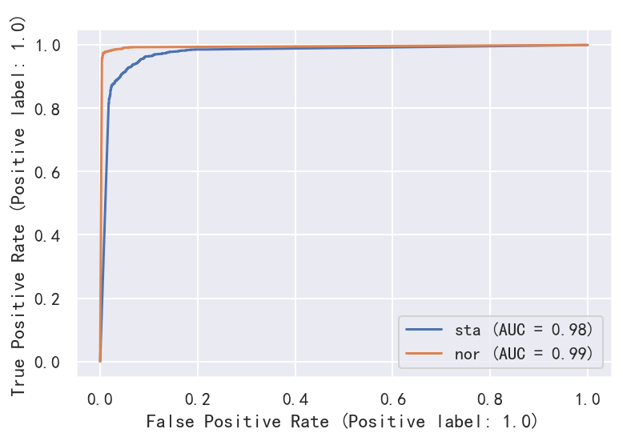
    


# 数据初步分析：

**预处理结束，接下来就绘图看看他们的关系**

 > 先画热力图，这里我们不使用onehot编码过的数据来绘制


```python
data = pd.read_csv('./data/data_without_onehot.csv')
plt.figure(figsize=(12,9))
corr = data.corr()
sns.heatmap(corr,cmap='Greys',annot=True)
plt.title('相关性系数矩阵热力图',fontsize=30)
plt.show()
```


    
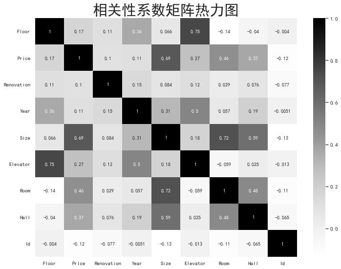
    


    这次可以很直观的去看到各项之间的相关系数

>可以看到，房价和大小，楼层与电梯，电梯和年份都有着较高的相关性

## 绘制图像：

### 1、大小和房价的关系


```python
plt.figure(figsize=(12,9))
sns.scatterplot(x=data['Price'],y=data['Size'], hue='Size',data=data,palette='coolwarm')

plt.xticks(fontsize=20)
plt.yticks(fontsize=20)
plt.title('房屋大小与价格的关系散点图',fontsize=40)
plt.xlabel('价格（万元）',fontsize = 22)
plt.ylabel('大小（平方米）',fontsize = 22)
plt.show()
```


    
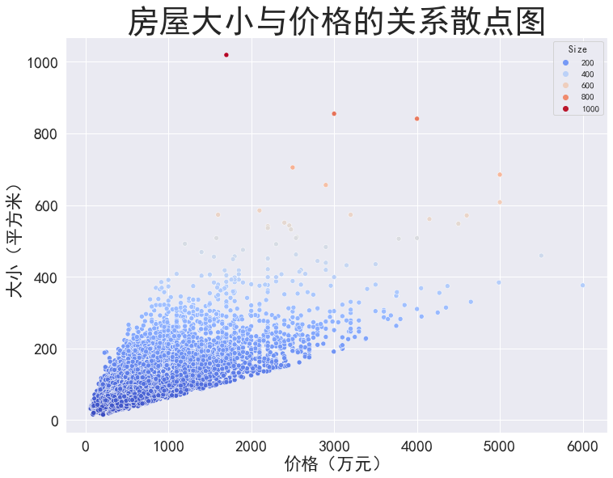
    


>房子越大，价格越高

### 2、 电梯与楼层的关系


```python
data_have_elevator = np.array(data[(data['Elevator']==1.0)]['Floor'].values)
data_no_elevator = np.array(data[(data['Elevator']==0.0)]['Floor'].values)
Elevator_have = np.arange(1,len(data_have_elevator)+1,dtype=int)
Elevator_no = np.arange(1,len(data_no_elevator)+1,dtype=int)
plt.figure(figsize=(15,9))
plt.title('有无电梯与楼层高度的关系散点图',fontsize=40)
#绘制散点图
plt.scatter(Elevator_have,data_have_elevator,alpha=0.7)
plt.scatter(Elevator_no,data_no_elevator,c='r',alpha=1,marker='^')
#设置坐标轴字体大小
plt.xticks(fontsize=14)
plt.yticks(fontsize=21)
#设置横纵坐标标签
plt.xlabel('户主个数',fontsize=25)
plt.ylabel('楼层数',fontsize=25)
#添加标签
plt.legend(['有电梯','无电梯'],fontsize=18)
plt.show()
```


    
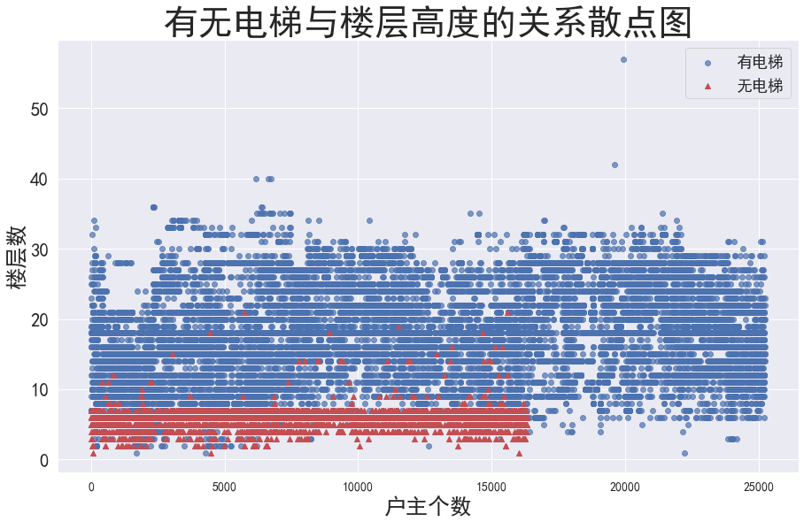
    


>总体来说，有电梯的还是占多数，说明客户更愿意选择有电梯的楼房<br>没有电梯的户主绝大部分都是居住在10层以下的，10层以上的绝大部分户主有电梯的

### 3、电梯和年份的关系


```python
data_have_elevator = np.array(data[(data['Elevator']==1.0)]['Year'].values)
data_no_elevator = np.array(data[(data['Elevator']==0.0)]['Year'].values)

Elevator_have = np.arange(1,len(data_have_elevator)+1,dtype=int)
Elevator_no = np.arange(1,len(data_no_elevator)+1,dtype=int)
plt.figure(figsize=(15,9))
plt.title('有无电梯与年份的关系散点图',fontsize=40)
#绘制散点图
plt.scatter(Elevator_have,data_have_elevator,alpha=0.7)
plt.scatter(Elevator_no,data_no_elevator,c='r',alpha=1,marker='^')
#设置坐标轴字体大小
plt.xticks(fontsize=14)
plt.yticks(fontsize=21)
#设置横纵坐标标签
plt.xlabel('户主个数',fontsize=25)
plt.ylabel('年份',fontsize=25)
#添加标签
plt.legend(['有电梯','无电梯'],fontsize=18)
plt.show()
```


    
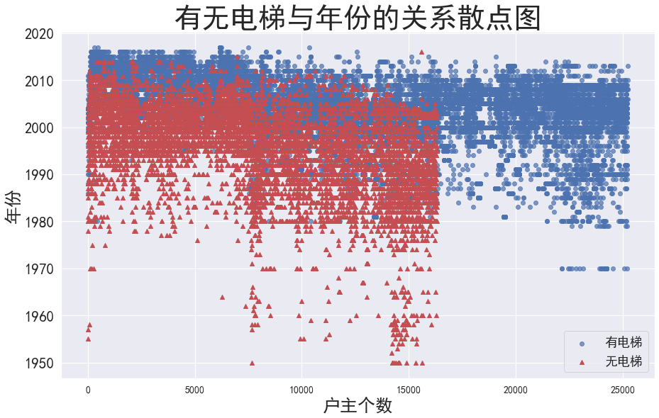
    


>随着时代发展，无电梯正在像着有电梯过度<br>1980年之前基本都是无电梯，2010年左右是个过度期，可见时代在进步和发展，人们的生活水平越来越好了<br>电梯房也成了一个主流的趋势，也是住户选择的一个重要标准

### 3、历年平均房价和年份的关系


```python
"""
价格和年份的关系折线图
:return:
"""
#将所有年份存放在列表中
data_year = data['Year'].unique()
#创建列表
mean_price = []
#sort从小到大排序
data_year.sort()

#整体数据按照年份升序排序
# data_sort_year = data.sort_values(by='Year',ascending=True)
# #ascending=True升序 False降序

#for循环求各个年份的房价平均值
for i in data_year:
    temp =  data[data['Year']==i]['Price']
    mean = temp.mean()#求平均
    mean_price.append(mean)

plt.figure(figsize=(12,9))
plt.title('历年房价平均值折线图',fontsize=40)
plt.xlabel('年份',fontsize=25)
plt.ylabel('价格（万元）',fontsize=25)
plt.xticks(fontsize=16)
plt.yticks(fontsize=16)
plt.plot(data_year,mean_price,c='deeppink',linewidth=3)
plt.show()
```


    
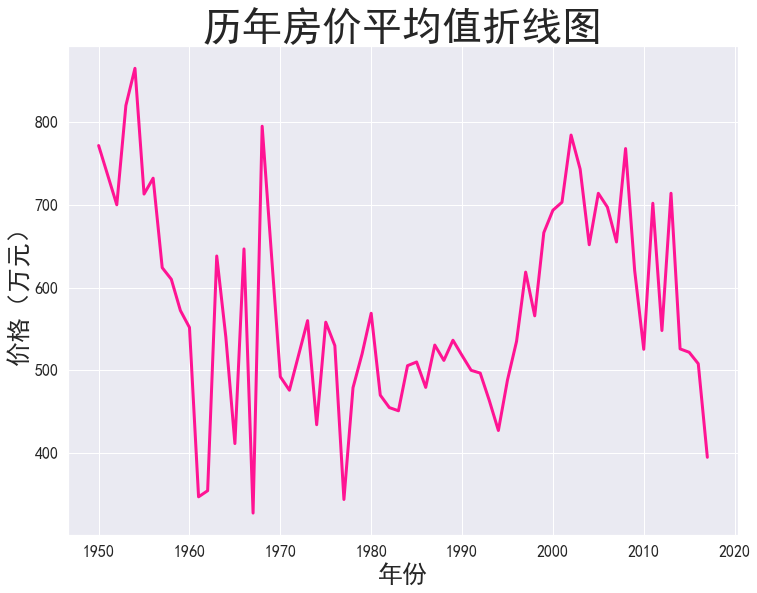
    


>由于1960年之前的数据量非常少，所以会出现1960年前的房价均值较高<br>可以看到，房价的波动较大，但总体来说以550万为轴上下波动，和之前预处理所绘制的箱型图相似

## 挖掘建模

在进行建模前我们先确定我们的模型的评估指标，最常见的有均方误差，以及绝对值误差，考虑到均方误差和绝对值误差没有去量纲，在数据量不同的训练模型时无法比较模型好坏，这边我们采用$R^2$的评估方法该方法的公式如下
$$
R^2(y,\hat y) = 1-\frac {\sum_{i=1}^n {(y_i-\hat y_i)^2}} {\sum_{i=1}^n(y_i-\overline y)^2}\\
where,\overline y = \frac 1n \sum_{i=1}^n y_i
$$

针对给定预处理好的数据我们进行挖掘建模
**首先**：选取建模的模型，这边我们首先采用的是目前最常见的线性回归的模型岭回归模型

岭回归的原理：在最小二乘法回归的基础上，添加惩罚项，防止过拟合
$$
f(x) =w_0+w_1x
$$

$$
J=\frac 1n \sum_{i=1}^n(f(x_i)−y_i)^2+\lambda\parallel w \parallel_2^2
$$
我们通过求偏导数为零作为损失函数进行计算每一个参数的最优值

拟合效果如下，只能进行线性拟合


**其次**：我们为了可以更好的评估模型的拟合程度，讲原有数据按照8：2分成训练集和验证集


```python
#导入需要使用的包
import pandas as pd
from sklearn.linear_model import Ridge
import matplotlib.pyplot as plt
from sklearn.pipeline import make_pipeline
from sklearn.preprocessing import PolynomialFeatures
from sklearn.tree import DecisionTreeClassifier,DecisionTreeRegressor,plot_tree
from sklearn.ensemble import RandomForestClassifier,RandomForestRegressor
from sklearn.model_selection import GridSearchCV
```


```python
#获取数据函数分成训练验证集
def get_data(data,frac=0.8):
    trainData = data.sample(frac=frac, random_state=0, axis=0)
    x_train = trainData.iloc[:, :-1]
    y_train = trainData["Price"]
    devData = data[~data.index.isin(trainData.index)]
    x_dev = devData.iloc[:, :-1]
    y_dev = devData["Price"]

    return x_train,y_train,x_dev,y_dev,trainData,devData,data
```

### 岭回归训练

岭回归训练，并且评估训练集，这边我们只把相关性最高的几个属性列放进去进行训练


```python
#读取数据
data = pd.read_csv("./data/data_normalization.csv")
data = data[["Size","Year","Floor","Renovation","Price"]]
x_train,y_train,x_dev,y_dev,trainData,devData,data = get_data(data)
r = Ridge()
#训练
r.fit(x_train,y_train)
print(r.score(x_dev,y_dev))
#画图
plt.figure(figsize=(16, 10), dpi = 144)
plt.rcParams['font.sans-serif'] = ['SimHei']
plt.scatter(x_dev.iloc[:, 0], y_dev, c='lightskyblue', label='data') #训练样本
plt.scatter(x_dev.iloc[:, 0], r.predict(x_dev), c='lightsalmon', label='prediction', lw=2) #拟合曲线
plt.axis('tight')
plt.title('Ridge regression (k =%f)' % r.score(x_dev,y_dev))
plt.ylabel("Prices")
plt.show()
```

    0.4932090585722808
    


    
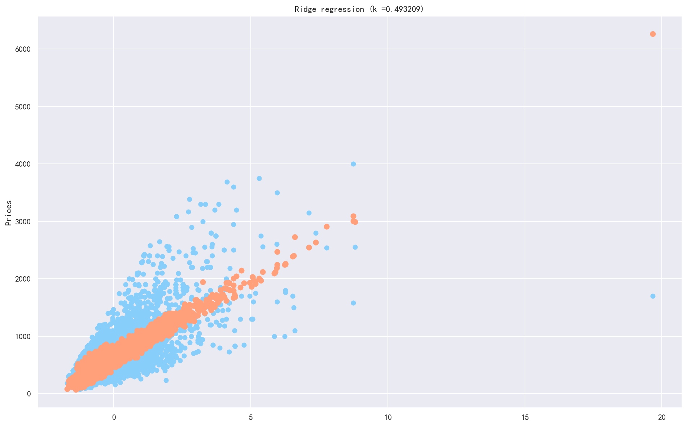
    


我们发现效果并不好，于是我们考虑到属性列太少，模型学习到的特征太少，我们添加了其余的分区的地址属性特征


```python
data = pd.read_csv("./data/data_normalization.csv")
#添加了其余的方位等属性列
data = pd.concat([data[["Size","Year","Floor","Renovation"]],data.iloc[:, 11:93],data["Price"]],axis=1)
x_train,y_train,x_dev,y_dev,trainData,devData,data = get_data(data)
r = Ridge()
#训练
r.fit(x_train,y_train)
print(r.score(x_dev,y_dev))
#画图
plt.figure(figsize=(16, 10), dpi = 144)
plt.rcParams['font.sans-serif'] = ['SimHei']
plt.scatter(x_dev.iloc[:, 0], y_dev, c='lightskyblue', label='data') #训练样本
plt.scatter(x_dev.iloc[:, 0], r.predict(x_dev), c='lightsalmon', label='prediction', lw=2) #拟合曲线
plt.axis('tight')
plt.title('Ridge regression (k =%f)' % r.score(x_dev,y_dev))
plt.ylabel("Prices")
#plt.title()
plt.show()
```

    0.73181855878572
    


    
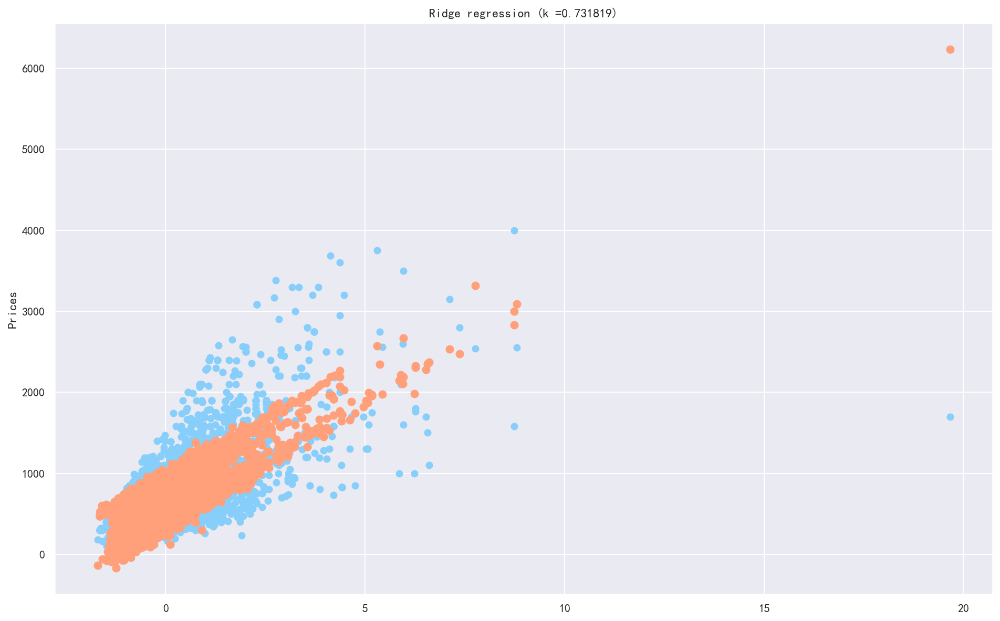
    


我们发现效果提升很明显但是还是有很大的问题，**岭回归**本身是一次插值，并且是线性的，进行拟合的，从之前的特征工程的图中我们可以发现，很多特征属性与房价的关系是非线性的，拟合的效果并不是特别好，于是我们提高它的插值次数，将线性模型进行非线性回归，可以提高它的特征空间，来提高效果。


```python
%%time

#读取数据
data = pd.read_csv("./data/data_normalization.csv")
#生成训练集和验证集
data = pd.concat([data[["Size","Year","Floor","Renovation"]],data.iloc[:, 70:93],data["Price"]],axis=1)
x_train,y_train,x_dev,y_dev,trainData,devData,data = get_data(data)
#进行3此多项式插值
r = make_pipeline(PolynomialFeatures(3), Ridge())
#训练
r.fit(x_train,y_train)
print(r.score(x_dev,y_dev))
#画图
plt.figure(figsize=(16, 10), dpi = 144)
plt.rcParams['font.sans-serif'] = ['SimHei']
plt.rcParams['axes.unicode_minus']=False
plt.scatter(x_dev.iloc[:, 0], y_dev, c='lightskyblue', label='data') #训练样本
plt.scatter(x_dev.iloc[:, 0], r.predict(x_dev), c='lightsalmon', label='prediction', lw=2) #拟合曲线
plt.axis('tight')
plt.title('Ridge regression（Polynomial） (k =%f)' % r.score(x_dev,y_dev))
plt.ylabel("Prices")
plt.show()
```

    0.8016009490366013
    


    
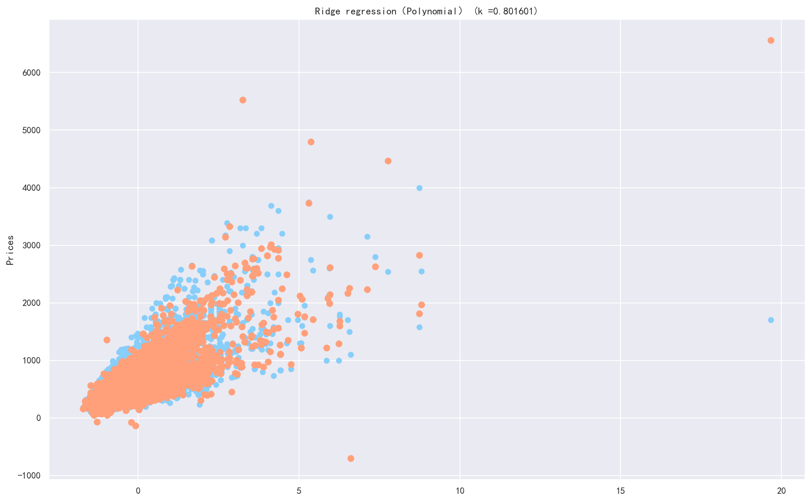
    


    Wall time: 15 s
    

我们发现通过多项式插值后效果有了很打的提升，但是如果需要再进一步进行效果提升就难了，原因是由目前的房价的各个特征与房价的关系来看，非线性和线性都不能特别好的拟合各个特征与房价的关系，于是我们采用概率论中的条件概率的思想来进行回归，这里用到决策树模型，决策树就是类似利用该思想的一种模型

### 决策树
##### 算法讲解
ID3

熵（entropy）

其中$p_i$为$X=x_i$的概率值，我们知道熵在高中化学中的物理意义是当一个事物的熵越小越趋于稳定，由于世间万物都是趋向于稳定发展，所以熵越小的发生的概率也就越大，决策树利用的就是这一原理。以下公式的符号是为了保证熵值大于零
$$
H(x) = - \sum_{i=1}^np_ilogp_i
$$
条件熵（conditional entropy）

条件熵是给定某一个条件下的熵的值。
$$
H(Y|X) = \sum_{i=1}^np_iH(Y|X=x_i)
$$
经验熵

其实本质与熵没有特别大的区别就是把$p_i$的计算公式确定下来

D代表整个样本，$C_k$代表分类目标的个数
$$
H(D) = \sum_{k=1}^k\frac {|C_k|}{|D|}log_2\frac {|C_k|}{|D|}
$$
条件熵
$$
H(D|A) = \sum_{i=1}^n\frac {|D_i|}{|D|}H(D_i)
$$
信息增益（information gain）

信息增益是通过熵减去条件熵，我们知道熵的值一定是大于条件熵的值，相减后我们取信息增益最大的作为分支对象，其实就是条件熵最小的作为分支对象
$$
g(D|A) = H(D)-H(D|A)
$$
但是此方法只能进行分类

<div align=center>

</div>

我们从之前的相关系数矩阵热力图中可以看出，厅与其他的特征列的相关性并不是特别强因此，用knn回归的效果并不是特别好，但是它与其他特征属性列并不是完全独立的，我们可以利用决策树的算法优势进行分类来提高它的准确度


```python
%%time

def get_data(dataPath='./data/data_final.csv',frac=0.8):
    data = pd.read_csv(dataPath)
    data = pd.concat([data.iloc[:, 11:91],data["Price"],data[["Size","Year","Floor","Elevator","Hall"]]],axis=1)
    # data = pd.concat([data[["Size","Floor","Hall","Room","Price"]]],axis=1)
    trainData = data.sample(frac=frac, random_state=0, axis=0)
    x_train = trainData.iloc[:, :-1]
    y_train = trainData["Hall"]
    devData = data[~data.index.isin(trainData.index)]
    x_dev = devData.iloc[:, :-1]
    y_dev = devData["Hall"]

    return x_train,y_train,x_dev,y_dev,trainData,devData,data
x_train,y_train,x_dev,y_dev,trainData,devData,data = get_data(dataPath='./data/data_final.csv',frac=0.8)
dtc = DecisionTreeClassifier(criterion="entropy")
dtc.fit(x_train,y_train)
print("sccore:"+str(dtc.score(x_dev,y_dev)))
```

    sccore:0.8773323702901168
    Wall time: 629 ms
    

我们发现准确率提升了很多而且速度非常快，这都归功于决策树利用计算**条件熵**让模型学习到了与厅相关的属性列的特征，这是回归模型在数据没有经过特殊处理无法做到的。

并且我们还可以采用模型集成的方法来提高它的准确度，最常见的模型集成有**Bagging，Boosting，Stacking**这些方法，这边我采用**Bagging**中最具有典型代表的**随机森林**

**随机森林**是由很多决策树构成的，不同决策树之间没有关联。

当我们进行分类任务时，新的输入样本进入，就让森林中的每一棵决策树分别进行判断和分类，每个决策树会得到一个自己的分类结果，**决策树**的分类结果中哪一个分类最多，那么**随机森林**就会把这个结果当做最终的结果。（其实随机森林的原理就是由于训练的每颗树的数据来源不同，每颗树的形状不一样，集成每颗树树的优点投票获取更好的预测）


```python
%%time

rfc = RandomForestClassifier(criterion="entropy")
rfc.fit(x_train,y_train)
print("score:",rfc.score(x_dev,y_dev))
```

    score: 0.9073070904056819
    Wall time: 4.96 s
    

这边我们用100颗树来进行**Bagging集成**,可以看到最终的准确度来到了90%,接下来我们为了得到更好的模型参数，我们采用**3折交叉验证**的方法获取更好的模型参数


```python
%%time

param={
    "max_depth":[10,20,30],
    "n_estimators":[100,150,200],
    "criterion":["gini", "entropy"]
}
clf = RandomForestClassifier()

cv = GridSearchCV(clf,param_grid=param,cv=3,n_jobs=-1)
cv.fit(data.iloc[:, :-1],data["Hall"])
print(cv.best_estimator_)
rfc = RandomForestClassifier(n_estimators=150,criterion="entropy",max_depth=20)
rfc.fit(x_train,y_train)
print("score:",rfc.score(x_dev,y_dev))
```

    D:\anaconda\envs\ProcessData\lib\site-packages\sklearn\model_selection\_split.py:668: UserWarning: The least populated class in y has only 2 members, which is less than n_splits=3.
      % (min_groups, self.n_splits)), UserWarning)
    

    RandomForestClassifier(criterion='entropy', max_depth=10, n_estimators=150)
    score: 0.9103166004574456
    Wall time: 1min 54s
    

精确度不能达到电梯那么高除了属性列相关性的问题，还有就是它是一个多分类的问题，比电梯的二分类更困难，该方法还可以应用到其他属性列的预测当中去,列如预测商品房的装修程度，是否为精装修还是毛胚房


```python
print("Hall的分类范围"+str(data["Hall"].unique()))
```

    Hall的分类范围[1. 2. 0. 3. 4. 5.]
    

以上我们介绍的是**ID3信息增益的算法**，该算法是无法进行回归的
因此我们接下来采用**CART**方法进行回归
##### 算法讲解
1、选择最优切分变量j与切分点s，求解：
$$
MSE (mean\ \ squared\ \ error)= \mathop{\text{min}}\limits_{(j,s)}[\mathop{\text{min}}\limits_{c_1}\sum_{X_i\in R_1(j,s)}(y_i-c_1)^2+\mathop{\text{min}}\limits_{c_2}\sum_{X_i\in R_2(j,s)}(y_i-c_2)^2]
$$
遍历变量j，对固定的切分变量j扫描切分点s，选择使上式取得最小值的对(j,s)。其中$R_m$是被划分的输入空间，$C_m$空间$R_m$对应的输出值。

2、用选定的对(j,s)划分区域并决定相应的输出值：
$$
R_1(j,s)=\{x|x^{(j)}\le s \},R_2(j,s)=\{x|x^{(j)}\gt s\} \\
c_m=\frac 1{N_m}\sum_{X_i\in R_m(j,s)}y_i   \\ x\in R_m ,m=1,2
$$
3、继续对两个子区域调用步骤1，直至满足停止条件。

4、将输入空间划分为M个区域$R_1,R_2,...R_m$生成决策树：

### 采用单颗决策树模型

决策树是用来做分类的，但是我们也可以用来做回归，原因是分类和回归的本质是一样的，区别在于一个是离散的，一个是连续的，当我们的决策树的分支足够多的时候离散的就可以逼近连续。所以我们首先还是按照之前的数据特征作为输入，用决策树进行回归预测


```python
##数据读取

def get_data(data,frac=0.8):
    data = data[['Size', 'Year', 'Room','Direction','District','Garden', 'Region', 'Floor',
                 'Renovation', 'Elevator', 'Hall','Price']]
    trainData = data.sample(frac=frac, random_state=0, axis=0)
    x_train = trainData.iloc[:, :-1]
    y_train = trainData["Price"]
    devData = data[~data.index.isin(trainData.index)]
    x_dev = devData.iloc[:, :-1]
    y_dev = devData["Price"]

    return x_train,y_train,x_dev,y_dev,trainData,devData,data
data = pd.read_csv("./data/encode_data_addMissHall.csv")
x_train,y_train,x_dev,y_dev,trainData,devData,data = get_data(data,frac=0.8)
```


```python
%time

#训练
d = DecisionTreeRegressor()
d.fit(x_train,y_train)
print(d.score(x_dev,y_dev))
```

    Wall time: 0 ns
    0.9009971873414976
    

查看效果


```python
%%time

#画图
plt.figure(figsize=(16, 10), dpi = 144)
plt.rcParams['font.sans-serif'] = ['SimHei']
plt.rcParams['axes.unicode_minus']=False
plt.scatter(x_dev.iloc[:, 0], y_dev, c='lightskyblue', label='data',) #训练样本
plt.scatter(x_dev.iloc[:, 0], d.predict(x_dev), c='lightsalmon', label='prediction', lw=2) #拟合曲线
plt.axis('tight')
plt.title('DecisionTree regression (k =%f)' % d.score(x_dev,y_dev))
plt.xlabel("Size")
plt.ylabel("Prices")
plt.show()
#画决策树
plt.figure(figsize=(35,10),dpi=144)
plt.rcParams['font.sans-serif'] = ['SimHei']
plt.rcParams['axes.unicode_minus']=False
plot_tree(d,max_depth=3,feature_names=x_train.columns,filled=True)
plt.show()
```


    

    


    
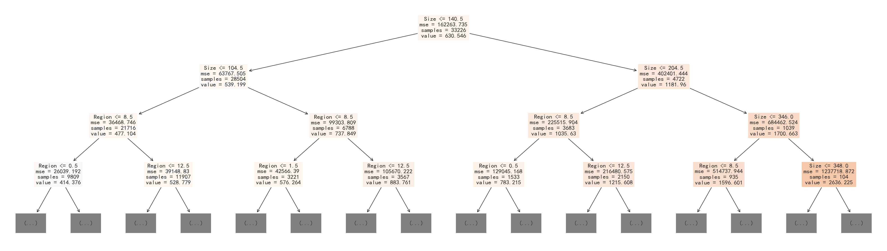
    


    Wall time: 2.19 s
    

我们发现速度很快，原因是它与岭回归的区别是不需要迭代求最优值，直接计算信息增益就可以，并且采用决策树这种条件概率的算法更适合我们的数据，事实上也确实如此，决定房价的因素很多并且与房价的关系很复杂，如果一套房满足面积大，楼层高，有电梯，精装修，房间多，厅室多等条件它的价格普遍是非常高的

### 集成学习

然后我们接下来还是通过用**bagging随机森林**并且用**K折交叉验证**的方法来进行提升

 


```python
class HousePricePredictByRandomForestRegressor():
    def __init__(self,n_estimators=500,max_depth=30,oob_score=True):
        self.clf = RandomForestRegressor(n_estimators=n_estimators,max_depth=max_depth, random_state=0,oob_score=oob_score)

    def get_data(self,data,frac=0.8):
        data = data[['Size', 'Year', 'Room','Direction','District','Garden', 'Region', 'Floor',
                     'Renovation', 'Elevator', 'Hall','Price']]
        trainData = data.sample(frac=frac, random_state=0, axis=0)
        x_train = trainData.iloc[:, :-1]
        y_train = trainData["Price"]
        devData = data[~data.index.isin(trainData.index)]
        x_dev = devData.iloc[:, :-1]
        y_dev = devData["Price"]

        return x_train,y_train,x_dev,y_dev,trainData,devData,data

    def train(self,x_train,y_train):
        return self.clf.fit(x_train,y_train)

    def dev(self,x_dev,y_dev):
        return self.clf.score(x_dev,y_dev)

    def predict(self,x_data):
        return self.clf.predict(x_data)

    def plot_fit_curve(self,x_data,y_data,y_pred,i=0):
        plt.figure(figsize=(16, 10), dpi = 144)
        plt.rcParams['font.sans-serif'] = ['SimHei']
        plt.scatter(x_data.iloc[:, i], y_data, c='lightskyblue', label='data',alpha=0.8) #训练样本
        plt.scatter(x_data.iloc[:, i], y_pred, label='prediction',c='lightsalmon', lw=2,alpha=0.8) #拟合曲线
        plt.axis('tight')
        plt.title('RandomForestRegressor (k =%f)' % self.clf.score(x_data,y_data))
        plt.xlabel(x_data.columns[i])
        plt.ylabel("Prices")
        plt.show()

    def heighten_data(self,data,frac=0.8):
        data = data[['Size', 'Year', 'Room','Direction','District','Garden', 'Region', 'Floor',
                     'Renovation', 'Elevator', 'Hall','Price']]


#         data = pd.concat([data,extra_data],axis=0)
        trainData = data.sample(frac=frac, random_state=0, axis=0)
        devData = data[~data.index.isin(trainData.index)]
        extra_data = trainData[trainData["Price"]>1500].copy()
        extra_data.index=range(len(data),len(data)+len(extra_data))
        trainData = pd.concat([trainData,extra_data],axis=0)
        
        x_train = trainData.iloc[:, :-1]
        y_train = trainData["Price"]
        
        x_dev = devData.iloc[:, :-1]
        y_dev = devData["Price"]

        return x_train,y_train,x_dev,y_dev,trainData,devData,data


    def Cross_Validation(self,data,param):
        start = time.time()
        clf = RandomForestRegressor(oob_score=True)
        cv = GridSearchCV(clf,param_grid=param,cv=5)
        cv.fit(data.iloc[:, :-1],data["Price"])
        print(cv.best_score_)
        print(cv.best_params_)
        end = time.time()
        print("time:"+str(start-end))
        return cv.best_estimator_
```


```python
%%time
#实例化模型
clf = HousePricePredictByRandomForestRegressor()
#读取数据
data =pd.read_csv("./data/encode_data_addMissHall.csv")
x_train,y_train,x_dev,y_dev,trainData,devData,data = clf.get_data(data)
#训练
clf.train(x_train,y_train)
#评估
score = clf.dev(x_dev,y_dev)
print(score)
y_pred = clf.predict(x_dev)
for i in range(3):
    clf.plot_fit_curve(x_dev,y_dev,y_pred,i=i)
plt.figure(figsize=(16, 10), dpi = 144)
plt.rcParams['font.sans-serif'] = ['SimHei']
plt.rcParams['axes.unicode_minus']=False
plt.scatter(y_pred, y_dev, c='lightskyblue', label='data',alpha=0.8) #训练样本
# plt.scatter(x_dev.iloc[:, 0], d.predict(x_dev), c='darkorange', label='prediction', lw=2,alpha=0.8) #拟合曲线
plt.axis('tight')
plt.title('RandomForestRegressor (k =%f)' % score)
plt.xlabel("Prices")
plt.ylabel("Prices")
plt.show()
```

    0.9457468738633779
    


    

    


    
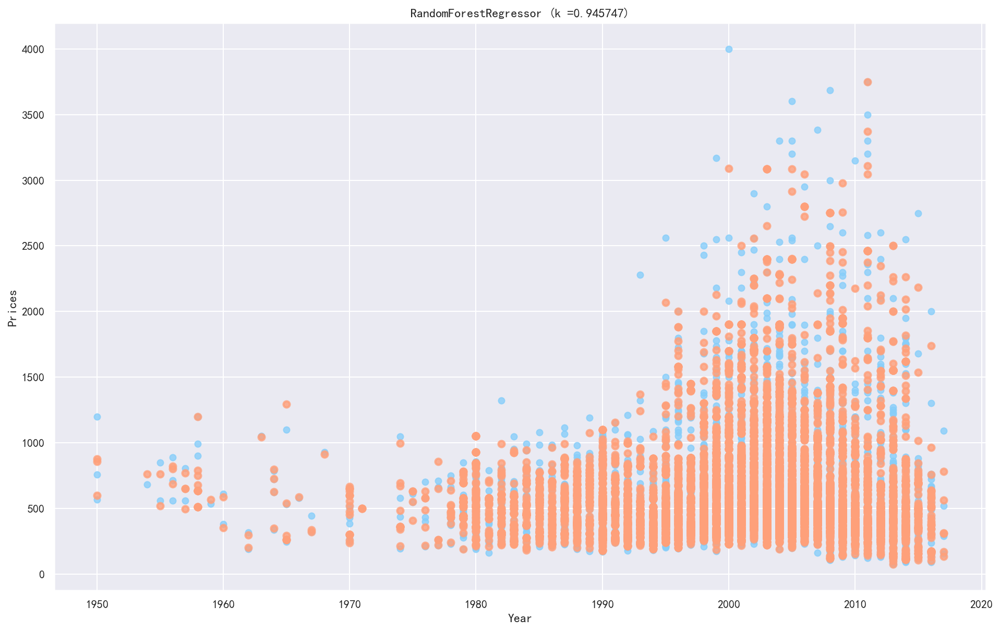
    


    

    


    
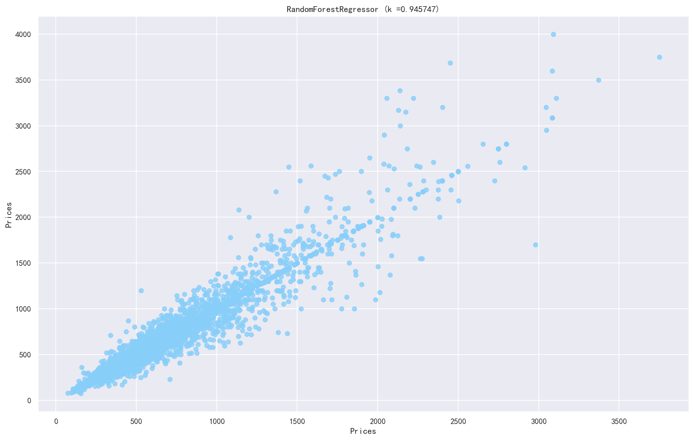
    


    Wall time: 1min 18s
    

我们可以把森林中挑选出三个树来画决策树，我们可以发现每颗决策树都长的不一样


```python
%%time
for e in clf.clf.estimators_[:3]:
    #画决策树
    plt.figure(figsize=(35,10),dpi=144)
    plt.rcParams['font.sans-serif'] = ['SimHei']
    plt.rcParams['axes.unicode_minus']=False
    plot_tree(e,max_depth=3,feature_names=x_train.columns,filled=True)
    plt.show()
```


    
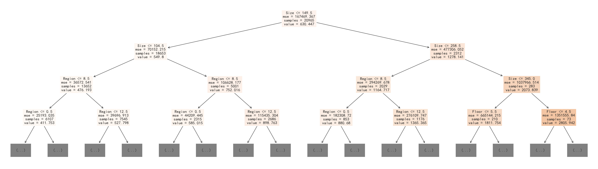
    


    
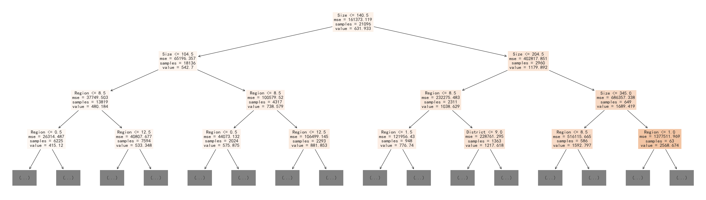
    


    
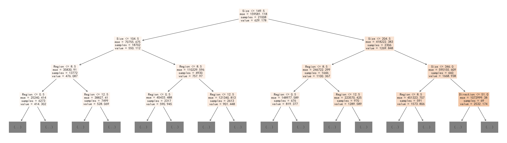
    


    Wall time: 5.5 s
    

考虑到我们的训练数据很少的情况，我们通过将原始数据进行增强，提高它的泛化能力


```python
%%time
#实例化模型
clf = HousePricePredictByRandomForestRegressor()
#读取数据
data =pd.read_csv("./data/encode_data_addMissHall.csv")
# 增强数据
x_train,y_train,x_dev,y_dev,trainData,devData,data = clf.heighten_data(data)
#训练
clf.train(x_train,y_train)
#评估
score = clf.dev(x_dev,y_dev)
print(score)
y_pred = clf.predict(x_dev)
for i in range(3):
    clf.plot_fit_curve(x_dev,y_dev,y_pred,i=i)
plt.figure(figsize=(16, 10), dpi = 144)
plt.rcParams['font.sans-serif'] = ['SimHei']
plt.rcParams['axes.unicode_minus']=False
plt.scatter(y_pred, y_dev, c='lightskyblue', label='data',alpha=0.8) #训练样本
# plt.scatter(x_dev.iloc[:, 0], d.predict(x_dev), c='darkorange', label='prediction', lw=2,alpha=0.8) #拟合曲线
plt.axis('tight')
plt.title('RandomForestRegressor (k =%f)' % score)
plt.xlabel("Prices")
plt.ylabel("Prices")
plt.show()
```

    0.946228968473117
    


    
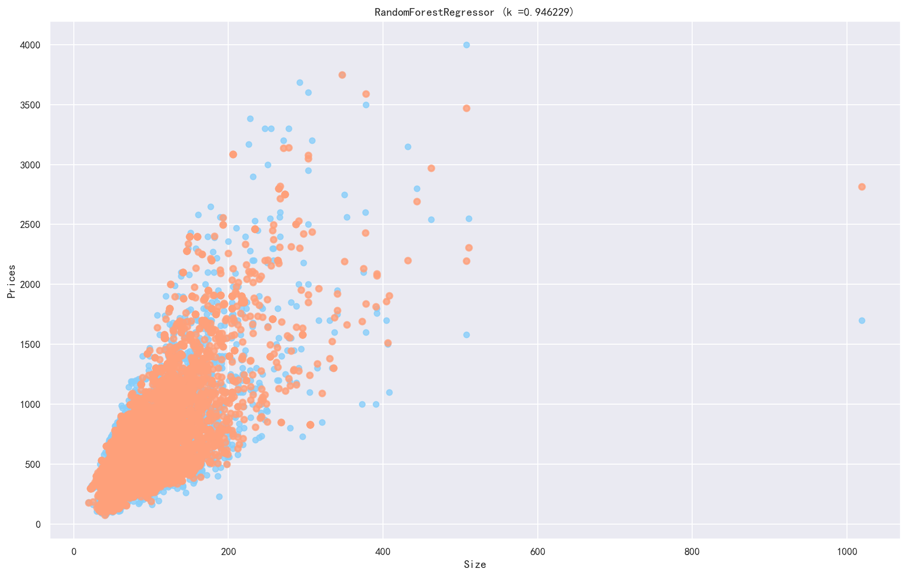
    


    

    


    
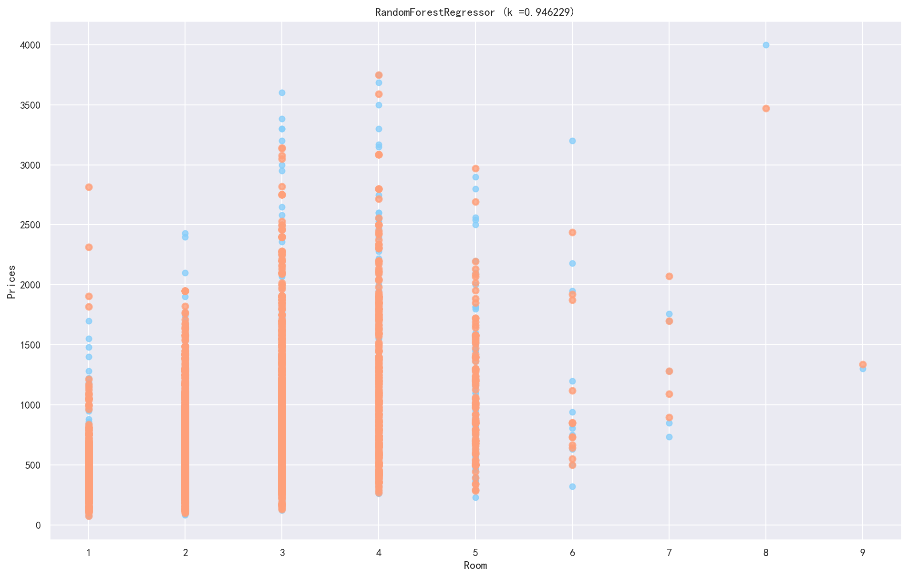
    


    

    


    Wall time: 1min 39s
    

我们发现通过数据增强的方法效果明没有特别明显的提升，可以说采用数据增强的方法失败了，接下来，我们想通过用boosting集成的方法会不会有更好的效果呢？

#### Boosting方法

##### boosting思想

在我原来的训练好的回归模型的基础上，在添加一个模型来拟合原来的模型的残差（误差），然后将这些模型预测出来的值求和即为最终的预测目标，好处在于我可以不改变我最初的模型的参数，在它的基础上进行提升。就像我使用决策树我已经可以有一个很不错的拟合效果了，但是还是有误差，那我该如何减少这些误差呢？通过再训练一个树来拟合这些误差。GDBT用的就是这种思想

说到决策树在boosting方面的应用，这边用到的是基于GDBT的XGboost，我们先简单介绍一下

##### GBDT(Gradient Boosting Decision Tree)，全名叫梯度提升决策树，使用的是**Boosting**的思想。

GBDT的原理很简单，就是所有弱分类器的结果相加等于预测值，然后下一个弱分类器去拟合误差函数对预测值的残差(这个残差就是预测值与真实值之间的误差)。当然了，它里面的弱分类器的表现形式就是各棵树。

举一个非常简单的例子，比如我今年30岁了，但计算机或者模型GBDT并不知道我今年多少岁，那GBDT咋办呢？

- 它会在第一个弱分类器（或第一棵树中）随便用一个年龄比如20岁来拟合，然后发现误差有10岁；
- 接下来在第二棵树中，用6岁去拟合剩下的损失，发现差距还有4岁；
- 接着在第三棵树中用3岁拟合剩下的差距，发现差距只有1岁了；
- 最后在第四课树中用1岁拟合剩下的残差，完美。
- 最终，四棵树的结论加起来，就是真实年龄30岁（实际工程中，gbdt是计算负梯度，用负梯度近似残差）。

GBDT的损失函数为均方误差，通过对均方误差求偏导求负梯度更新参数
<div align = center>

</div>
在GBDT的迭代中，假设我们前一轮迭代得到的强学习器是$f_{t−1}(x)$, 损失函数是$L(y,f_{t−1}(x))$, 我们本轮迭代的目标是找到一个CART回归树模型的弱学习器$h_t(x)$，让本轮的损失函数$L(y,f_t(x))=L(y,f_{t−1}(x)+h_t(x))$最小。也就是说，本轮迭代找到决策树，要让样本的损失尽量变得更小。
$$
L(y,f_t(x)) = \frac 12(y-f_t(x))^2
$$
损失函数负梯度表示(也就是残差)
$$
r_{ti} = -[\frac {\alpha l(y_i,f_t(x))} {\alpha f_t(x)}] = (y_i-f_t(x))
$$
然后我们通过$(x,r_ti)$进行拟合训练下一个弱学习器。通过损失函数的负梯度来拟合，我们找到了一种通用的拟合损失误差的办法，这样无轮是分类问题还是回归问题，我们通过其损失函数的负梯度的拟合，就可以用GBDT来解决我们的分类回归问题。区别仅仅在于损失函数不同导致的负梯度不同而已。

##### XGboost于GBDT的区别

目标函数的不同
$$
Obj^{(t)} = \sum_{i=1}^nL(y_i,\hat y_i^{(t-1)}+f_t(x_i))+\Omega (f_t)+constant
$$
泰勒展开式来近似目标函数：

- 泰勒展开：定义$g_i$为目标L函数的一阶求导，$h_i$为二阶求导

- $$
  Obj^{(t)} \approx \sum_{i=1}^n[L(y_i,\hat y_i^{(t-1)}+g_if_t(x_i)+\frac 12 h_if_t^2(x_i)]+\Omega (f_t)+constant
  $$

  其中$\Omega (f_t) = \gamma^T+\frac 12 \gamma \sum_{j=1}^Tw_j^2 $

除了算法上与传统的GBDT有一些不同外，XGBoost还在工程实现上做了大量的优化。总的来说，两者之间的区别和联系可以总结成以下几个方面。

1. GBDT是机器学习算法，XGBoost是该算法的工程实现。
2. 在使用CART作为基分类器时，XGBoost显式地加入了正则项来控制模 型的复杂度，有利于防止过拟合，从而提高模型的泛化能力。
3. GBDT在模型训练时只使用了代价函数的一阶导数信息，XGBoost对代 价函数进行二阶泰勒展开，可以同时使用一阶和二阶导数。
4. 传统的GBDT采用CART作为基分类器，XGBoost支持多种类型的基分类 器，比如线性分类器。
5. 传统的GBDT在每轮迭代时使用全部的数据，XGBoost则采用了与随机 森林相似的策略，支持对数据进行采样。
6. 传统的GBDT没有设计对缺失值进行处理，XGBoost能够自动学习出缺 失值的处理策略。


```python
%%time
from xgboost import XGBRegressor
import pandas as pd
import matplotlib.pyplot as plt
def get_data(data,frac=0.8):
    data = data[['Size', 'Year', 'Room','Direction','District','Garden', 'Region', 'Floor',
                 'Renovation', 'Elevator', 'Hall','Price']]
    trainData = data.sample(frac=frac, random_state=0, axis=0)
    x_train = trainData.iloc[:, :-1]
    y_train = trainData["Price"]
    devData = data[~data.index.isin(trainData.index)]
    x_dev = devData.iloc[:, :-1]
    y_dev = devData["Price"]

    return x_train,y_train,x_dev,y_dev,trainData,devData,data

data = pd.read_csv("./data/encode_data_addMissHall.csv")
x_train,y_train,x_dev,y_dev,trainData,devData,data = get_data(data)
x = XGBRegressor()
bst = x.fit(x_train,y_train)
print(bst.score(x_dev,y_dev))
y_pred = x.predict(x_dev)
plt.figure(figsize=(16, 10), dpi = 144)
plt.rcParams['font.sans-serif'] = ['SimHei']
plt.rcParams['axes.unicode_minus']=False
plt.scatter(y_pred, y_dev, c='lightskyblue', label='data',alpha=0.8) #训练样本
plt.axis('tight')
plt.title('XGBRegressor (k =%f)' % bst.score(x_dev,y_dev))
plt.xlabel("Prices")
plt.ylabel("Prices")
plt.show()
```

    0.9541532738038909
    


    
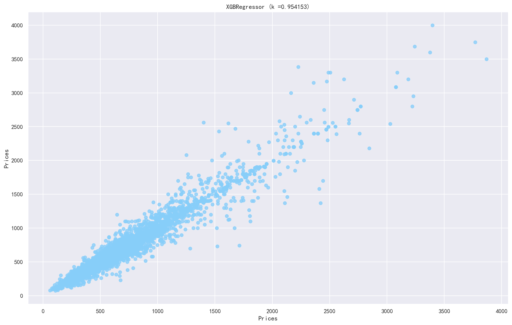
    


    Wall time: 1.43 s
    

采用交叉验证


```python
%%time
data = pd.read_csv("./data/encode_data_addMissHall.csv")
x_train,y_train,x_dev,y_dev,trainData,devData,data = get_data(data)
x = XGBRegressor(tree_method= 'auto', objective= 'reg:squarederror', n_estimators= 1400, min_child_weight= 10, max_depth= 6, gamma= 0, eta= 0.1)
bst = x.fit(x_train,y_train)
print(bst.score(x_dev,y_dev))
y_pred = x.predict(x_dev)
print(x.get_xgb_params())
plt.figure(figsize=(16, 10), dpi = 144)
plt.rcParams['font.sans-serif'] = ['SimHei']
plt.rcParams['axes.unicode_minus']=False
plt.scatter(y_pred, y_dev, c='lightskyblue', label='data',alpha=0.8) #训练样本
plt.axis('tight')
plt.title('XGBRegressor (k =%f)' % bst.score(x_dev,y_dev))
plt.xlabel("Prices")
plt.ylabel("Prices")
plt.show()
```

    0.9654150941555106
    {'objective': 'reg:squarederror', 'base_score': 0.5, 'booster': 'gbtree', 'colsample_bylevel': 1, 'colsample_bynode': 1, 'colsample_bytree': 1, 'gamma': 0, 'gpu_id': -1, 'interaction_constraints': '', 'learning_rate': 0.100000001, 'max_delta_step': 0, 'max_depth': 6, 'min_child_weight': 10, 'monotone_constraints': '()', 'n_jobs': 8, 'num_parallel_tree': 1, 'random_state': 0, 'reg_alpha': 0, 'reg_lambda': 1, 'scale_pos_weight': 1, 'subsample': 1, 'tree_method': 'auto', 'validate_parameters': 1, 'verbosity': None, 'eta': 0.1}
    


    
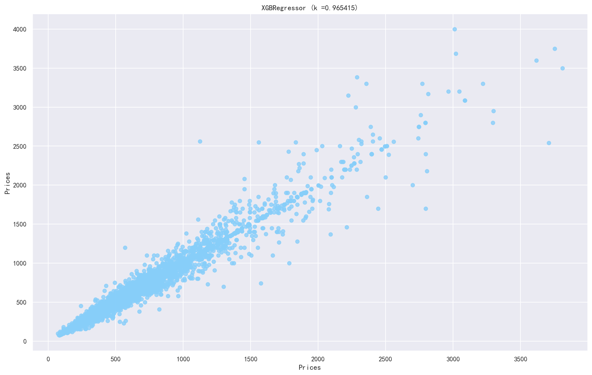
    


    Wall time: 13.5 s
    
